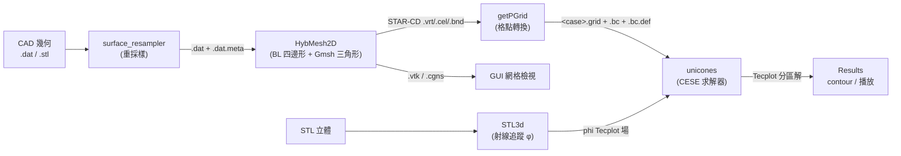
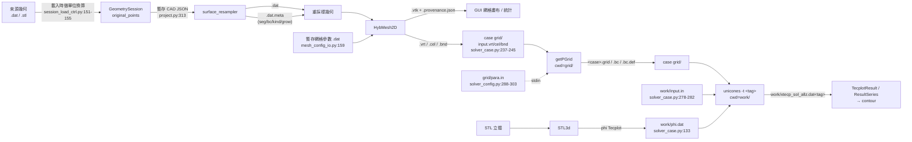

# HybMesh2D 架構總覽（模組、分層與資料流）

> **狀態：完成。** 全文內容逐行對照原始碼驗證過；未讀 / 未驗證的範圍誠實列在第 8 節。

## 1. 文件定位

本文件是 HybMesh2D 這個 repo 的**架構說明**：有哪些層、主要模組各自負責什麼、以及一條幾何從 CAD 到求解結果的**端到端資料流**（含每個階段之間靠哪種檔案格式交接）。

- **驗證基準日：2026-08-13**，分支 `feat/gui-interactive-cad-editing`。本文件所有結構性敘述都以**原始碼**為準，並以 `檔案:行號` 標註出處。
- `CLAUDE.md`、`README.md`、`docs/*_plan.md` 屬於「第一方但次級」資料：它們是**關於**程式碼的說明，其中部分是**尚未執行的計畫**。本文件只把它們當成「該去哪裡看」的線索，凡是結構性敘述都回頭對照程式碼；不一致之處集中列在第 7 節「與現有文件的落差」。
- 未讀 / 未驗證的範圍誠實列在第 8 節。

---

## 2. 系統全貌

這個 repo 是**四個可獨立執行的入口**加上一套**外部求解器（UNICONES）前後處理鏈**：

| 入口 | 種類 | 產出/角色 |
|---|---|---|
| `build/surface_resampler` | C++ 執行檔（`CMakeLists.txt:165`） | CAD 表面重採樣：JSON config → `.dat` + `.dat.meta` |
| `build/HybMesh2D` | C++ 執行檔（`CMakeLists.txt:121`） | 混合網格生成：`.dat`(+`.meta`) + `.dat` 參數檔 → `.vtk` / STAR-CD / （選用）CGNS |
| `tools/PreProcessor/gui/main.py` | PyQt6 GUI（223 檔、46,914 行） | 互動式前處理 + 全流程 orchestrator（`Run All`） |
| `tools/PreProcessor/run_pipeline.py` | Python CLI | 無頭全流程（由 `run_pipeline.sh` 包裝） |

求解器側**不是本 repo 自建**：`solver/` 整個目錄被 `.gitignore` 排除（`.gitignore:27`），其中求解器本體 `solver/execute/unicones.eqn6.mac` 只有預編譯二進位、**沒有原始碼**；前處理工具 `STL3d` / `getPGrid` / `bDecompose` 則同時附有原始碼與預編譯 binary（`solver/preprocess/*/src/`、`solver/preprocess/*/work/`）。

### 分層

- **C++ 幾何/網格核心** — `src/{main.cpp(1014),Mesh.cpp(1364),BoundaryLayer.cpp(1393)}` + `include/*.hpp`（約 5,150 行）。
- **C++ 重採樣器** — `tools/PreProcessor/src/main.cpp`（1,248 行）+ `tools/PreProcessor/include/{Spacing,Spline,Quality}.hpp`。`tools/PreProcessor/include/json.hpp` 是 vendored 的 nlohmann/json（25,526 行），僅作為 header-only 相依。
- **Python GUI** — `tools/PreProcessor/gui/app/`，以 `models` / `services`（業務邏輯，幾乎全部 Qt-free）／ `controllers` / `views` / `commands` / `workers` 分層。
- **求解器整合層** — GUI 的 Qt-free services（`pipeline_runner` / `solver_case` / `stl3d_case` / `case_export` …）負責準備 case 目錄、生成求解器輸入檔、以 subprocess 驅動外部 binary。

### 階段鏈



`STL3d` 產生的 φ 場是**沉浸邊界（IBM）**的旁路，只有啟用 immersed solid 的 case 才會經過；`bDecompose` 是可選旁路，主線預設 `getPGrid → unicones`。

---

## 3. 主要模組

### 3.1 C++ 幾何/網格核心（`src/` + `include/`）

`CMakeLists.txt:121-125` 定義 `HybMesh2D` 由 `src/main.cpp`、`src/Mesh.cpp`、`src/BoundaryLayer.cpp` 三個 TU 組成；`include/` 全為 header-only，透過 interface library `HybMeshUtils`（`CMakeLists.txt:118`）供兩個 binary 共用。

| 檔案 | 行數 | 職責（它擁有什麼概念） |
|---|---|---|
| `src/main.cpp` | 1014 | 流程編排者：CLI 解析、config 載入、幾何 + `.meta` sidecar 載入、per-geometry role 分派、碰撞檢查，以及所有匯出與 provenance 的呼叫點。擁有 `SurfaceMeta`（`:169-178`）與「幾何檔 → 節點/邊」的翻譯。 |
| `src/Mesh.cpp` | 1364 | 網格資料的實作、Gmsh 遠場三角化（單一函式 `:681-1364`）、Laplacian 平滑、BC 分類與三種匯出格式。 |
| `src/BoundaryLayer.cpp` | 1393 | 邊界層推進的**全部**演算法。`generate()`（`:88-1392`）是唯一的實質函式，所有階段內聯其中。 |
| `include/Mesh.hpp` | 150 | 網格資料模型：`NodeType`(:12)、`Node`(:18)、`Edge`(:37)、`Element`(:52)、`SeedGeom`(:60)、`Mesh`(:68) 與 segKey 編碼(:93)。 |
| `include/Config.hpp` | 644 | 全部參數模型：`BLParams`(:16-56) 與 `Config`(:58-642)，含解析、驗證、列印與 per-geometry override 解析。 |
| `include/BoundaryLayer.hpp` | 91 | BL 的內部狀態型別：`RayRole`(:10)、`RayInfo`(:12)、`FrontState`(:19-66)，以及只有兩個方法的 `BoundaryLayerGenerator`(:68-89)。 |
| `include/Curve.hpp` | 219 | 解析曲線抽象：`CurveKind`(:25)、`Curve` 基底(:50) 與 `LineCurve`(:64)／`CircleCurve`(:80，Kåsa 最小二乘擬合 :112)／`SmoothCurve`(:158)／`PolylineCurve`(:189)，工廠 `makeCurve`(:206)。曲線由**實際點**重建，不從序列化參數還原（:12-17）。 |
| `include/Provenance.hpp` | 150 | 輸出溯源 sidecar：`InputFingerprint`(:60，size+mtime)、`writeProvenance`(:108) 寫出 `<basename>.provenance.json`，config 區塊直接嵌入 `Config::print` 的轉義字串(:139-143)。 |
| `include/GeomUtils.hpp` | 54 | `Vector2D`/`Point2D`(:7,:31)、線段相交 `segmentsIntersect`(:34)、交點 `getIntersectionPoint`(:47)。 |
| `include/Logger.hpp` | 114 | `LOG_INFO/WARN/ERROR` 巨集(:110-112) 與 UTC 時戳(:52,:62)。 |
| `include/ExitCodes.hpp` | 30 | 7 個具語意的 exit code(:7-15) 與其穩定 token(:18)。 |
| `include/PointTolerance.hpp` | 24 | 單一常數 `POINT_COINCIDENCE_FRACTION = 0.05`(:22)，兩個 binary 共用的**相對**重合容差。 |

#### `HybMesh2D` 主流程

`main()` 位於 `src/main.cpp:426-1014`，依序為：

1. **CLI 第一階段掃描** — 找出 config 路徑與 `-geom`/`-seed`/`-geom_nobl` 清單；`kValueFlags`(:439-443) 讓帶值旗標的值不被誤認為位置參數 config 路徑 — `src/main.cpp:446-473`
2. **Config 載入** — `config.loadFromFile(configFile)`；明確指定的 `-conf` 開不起來即 `EXIT_ERR_CONFIG` — `:478-484`
3. **CLI 覆寫幾何清單** — `-geom` 取代 `config.geomFiles`；`-geom_nobl` 追加並登記進 `noBLGeoms` — `:487-501`
4. **CLI 第二階段覆寫** — BC、輸出開關、`-out_name`、`-domain`、`-domain_bl`、seed 參數 — `:504-535`
5. **`.*` 佔位符剝除** — GUI Output 欄位的萬用字元，在 `validate()`/`print()` 之前剝掉一次 — `:546-549`
6. **驗證與列印** — `config.validate()`(:553)、`config.print()`(:558)
7. **輸出路徑決定** — 未指定則由幾何 stem 組 `<case>`，經 `clampCaseName`(:138) 後成 `results/meshes/<case>/mesh_<case>.vtk`；接著 `create_directories`，失敗為 `EXIT_ERR_EXPORT` — `:563-596`
8. **無輸入的退化路徑** — 三種輸入皆空時直接 `mesh.generateCartesianMesh(...)` — `:605-606`
9. **域邊界建立** — `buildDomainBoundary`(:322)：自訂外框則以其 bbox 覆寫 `xMin..yMax`(:344-345) 並 `addTaggedLoop`(:346)；否則建矩形四邊並依序掛上 `bcYMin/bcXMax/bcYMax/bcXMin`(:359-361)。內流（`domainGrowBL`）**不走這裡** — `:612-616`
10. **幾何蒐集與 role 判定** — 本地 `struct GeomInput`(:622-629)。內流域壁先載入並覆寫 config box(:634-660)；其餘 `GEOM_FILE` 逐一 `loadGeometry`(:667)、`checkDomainIntersection`(:677)、`loadSurfaceMeta`(:681)、`reconcileMeta`(:682)，`growBL` 由是否在 `noBLGeoms` 決定(:683)；每個幾何的 `BLParams` 由 `config.blParamsFor(file)` 取得(:685) — `:621-686`
11. **`.meta` GROUP_BC trailer 併入 config** — 用 `emplace`，使 config `.dat` 的明確對應優先 — `:694-696`
12. **兩兩碰撞檢查** — `checkGeometriesIntersection`(:384)，內流時跳過包含性檢查、只保留線段交叉；命中即 `EXIT_ERR_INTERSECTION` — `:701-711`
13. **全域平均段長** — 供 `BL_AUTO_TRANSITION_LAYERS==1` 使用 — `:713-723`
14. **建節點/邊與成長方向** — no-BL 幾何走 `addTaggedLoop` 並配發獨立 `geomId`(:733,:736)；BL 幾何逐點建 `Boundary` 節點並套用 `.meta` 的 `segId`/`isCorner`/`segGrowBL`→`skipBL`/`segBc`→`bcTag`/`segKind`→`curveKind`(:742-765)。`growModes` 為域壁 +1、障礙物 −1(:812) — `:729-814`
15. **BL/no-BL 角點歸屬修正** — 被標記為角點且 `skipBL`、但鄰居有 BL 者，取消其 `skipBL` — `:776-785`
16. **逐邊 wall BC 記錄** — 趁邊界順序已知，呼叫 `mesh.recordBoundaryEdge(a, b, 起點節點)` 依「邊 i 屬於起點節點所在段」把 BC 與段鍵**一起**寫入 — `:794-810`
17. **孤兒 GROUP_BC 警告** — 比對 config 的 label 與節點實際攜帶的 `bcTag` — `:829-854`
18. **解析曲線覆蓋率報告** — 統計 line/circle/smooth/polyline 節點數，並對 circle 段做一次 `CircleCurve` 擬合 sanity check — `:856-889`
19. **邊界層生成** — `lastH = blGen.generate(allBoundaryIds, growModes, blParamsPerLoop)`，以 try/catch 包住；失敗設 `blSuccess=false` 與 `EXIT_ERR_BL`，但**仍往下匯出部分網格** — `:891-898`
20. **加密種子載入** — 只供 Gmsh 尺寸場；載入失敗為 `LOG_ERROR` 但不中止 — `:902-930`
21. **Gmsh 遠場** — `mesh.generateFarFieldGmsh(config, lastH, seeds, &gmshVersion)`；回傳 false 即 `EXIT_ERR_GMSH` — `:933-938`
22. **平滑** — `blSmoothingIters > 0` 時 `mesh.smoothMesh(...)` — `:939-941`
23. **統計輸出** — 節點/元素/邊界邊計數 — `:949-952`
24. **匯出 + provenance** — VTK(:972-988，失敗時檔名插入 `_er`)、STAR-CD(:990-1001，以 `stripExt` 取 prefix)、CGNS(:1003-1008)；每種各呼叫一次 `hybmesh::writeProvenance` — `:972-1008`
25. **回傳碼** — `reportError(failExit)` 或 `hasIntersection ? EXIT_ERR_BL : EXIT_OK` — `:1010-1013`

`loadGeometry`(:39-95) 讀 `x y` 對；封閉迴圈的重合尾點以**相對容差**（`POINT_COINCIDENCE_FRACTION × 局部點距`，:77-81）判定並 pop，真有間隙時發警告(:87-91)。

#### `BoundaryLayer` — 介面與內部階段

**公開介面只有兩個符號**（`include/BoundaryLayer.hpp:68-89`）：建構子 `BoundaryLayerGenerator(Mesh&, const Config&)`（定義 `src/BoundaryLayer.cpp:27-28`）與 `double generate(const std::vector<std::vector<int>>& allBoundaryNodeIds, const std::vector<int>& growModes = {}, const std::vector<BLParams>& blParamsPerLoop = {})`（定義 `src/BoundaryLayer.cpp:88-1392`）。私有的只有 `detectGrowthDirection`(:41-73) 與 `checkCollision`(:74-86)。

狀態型別 `FrontState`（`BoundaryLayer.hpp:19-66`）每個輸入 loop 一份，含 `activeFront`(:21)、`currentH`(:29)、`nodeDirections`(:30)、`junctionCapNodes`(:43)、`absorbedNoBLNodes`(:48)、`junctionCase`(:55)、`junctionColumns`(:56)、`slideColumns`(:64)、`slideWallRun`(:65)。

**內部階段順序**（全部內聯於 `generate()`）：

- **A. 逐 front 初始化**（`:102-726`）— 接縫去重(:116-120) → 成長方向(:121) → **法向計算**（有限差分 left/right normal，:143-150）→ 角點分類（凸 `blConvexAngleThreshold`、凹 `blConcaveAngleThreshold`、近直線容差 `CORNER_STRAIGHT_TOL = 8.0` 度，:140,:151-158）→ **解析法向覆寫**（`blUseAnalyticGeom`，經 `makeCurve` + `tangentAt`，跳過角點，:173-207）→ transition layer 數量（上限 `kMaxTransLayers = 1000`，:226-251）與 BL 總高 `D_total`(:254-265) → 自適應 fan 節點數(:267-299) → **BL/no-BL junction 偵測**(:321-342) → **四分支角度驅動 junction**（`blJunctionMethod == 1`）：θ ≤ `kSlideMaxTheta = 95.0`(:422) → case 1 沿鄰邊 slide；≤ `C2` → case 2 垂直 cap；≤ `C3` → case 3 鄰邊延伸 cap；否則 case 4 垂直 cap(:423-426)，步長以 `hmult = 1/max(0.25, dir·nBL)` 修正使**垂直高度**固定(:434)，極銳楔形警告(:463-479) → taper 模式（僅 `blJunctionMethod == 0`，`floorScale = 0.12` smoothstep，:492-523）→ 凹角 merge/blend（method 5）與 case 1/3 junction blend，影響半徑 `blConcaveInfluenceMultiplier × D_total`(:541-648) → junction 收尾，case 1 沿 no-BL 走一段並把節點記入 `absorbedNoBLNodes`(:661-724)
- **B. 逐層推進**（`:743-1139`）— 候選階段（重算法向、平行四邊形模式選擇）:757-792 → junction cap 強制單射線 :825-829 → 凸角平行四邊形 :833-878 → **凸角 fan**（只在第 0 層）:879-905 → 一般節點推進 :912-919 → **碰撞偵測** :923-951 → 提交與 retreat :953-984 → 子節點建立 :986-1007 → junction column 延伸 :1016-1024 → 四邊形帶縫合 :1033-1072 → **每層切向 front 平滑**（`blFrontSmoothingIters`，移除成長方向分量）:1084-1119 → 成長率步進 :1121-1126
- **C. 最終 front 與驗證**（`:1142-1246`）— `finalFronts` 組裝（丟棄 `absorbedNoBLNodes`、於 cap 處沿橫向 column 上下走）:1153-1190 → 越域檢查 :1203-1205 → 自交檢查 :1198-1227 → 跨幾何相交檢查 :1229-1245。四處失敗皆 `throw std::runtime_error`（:981, :1204, :1214, :1241）
- **D. 後處理與交棒**（`:1248-1391`）— 平行四邊形群組橫向平衡 :1251-1298 → **slide junction 的 BC 依弧長逐邊承接**（`carrySlideWallBc` → `recordBoundaryEdge(..., overwrite=false)` 與 `boundaryEdgeSeg` :1356）→ **遠場內邊界邊發射**（`m_mesh.addEdge` :1370，並把 `bcTag`/`segKey` 掛到 `edges.back()` :1381-1388）→ `return lastH` :1391

**`Mesh` 實際拿走什麼**：`FrontState`/`RayInfo` **完全不外流**，溝通只靠對 `Mesh` 的副作用與一個 `double` 回傳值 —— 最後一層厚度 `lastH`（:1391 → `src/main.cpp:892` → `generateFarFieldGmsh` 的 `finalBLThickness`）、新增的 BL 節點與元素、發射到 `m_mesh.edges` 的外緣約束邊(:1370)、以及 `boundaryEdgeBc`/`boundaryEdgeSeg` 兩張表(:1355-1356)。

#### `Mesh` — 資料結構、Gmsh 整合、匯出

**資料結構**（`include/Mesh.hpp`）：

- `Node`(:18-35)：`pos`、`type`、`id`、`geomId = -1`、`isFrozen = false`、`segId = -1`、`isCorner = false`、`skipBL = false`、`bcTag`、`curveKind = CurveKind::Polyline`
- `Edge`(:37-50)：`v1, v2`、`bcTag`、`segKey = -1`
- `Element`(:52-54)：只有 `std::vector<int> nodeIds`；**無 cell type 欄位**，型別在匯出時由 `nodeIds.size()` 推得
- `SeedGeom`(:60-66)：`points`、`closed`、`size`、`radius`、`embed`
- **私有**表 `boundaryEdgeBc` / `boundaryEdgeSeg`（key 為排序後的節點對）。外界只能經 `recordBoundaryEdge()` 成對寫入、`boundaryEdgeInfo()` 成對讀出 —— 兩者是同一件事實，分開寫是舊介面允許而現在由編譯器擋下的 bug
- `makeSegKey(geomId, segId)`(:93-96)：`geomId*1000000 + segId`，任一為負則 −1

**Gmsh 整合**全部集中在 `Mesh::generateFarFieldGmsh`（宣告 `Mesh.hpp:108-110`，定義 `src/Mesh.cpp:681-1364`）。API 呼叫序列：`initialize`(:684) → RAII `GmshFinalizeGuard`(:688-692) → 選項設定(:695-710) → `model::add`(:721) → 座標焊接後 `geo::addPoint`(:767) → `geo::addLine`(:795) → 迴圈追蹤後 `geo::addCurveLoop`(:859) → `geo::addPlaneSurface`(:881) → seed 的 point/line(:905,:914) → `geo::synchronize`(:927) → `mesh::embed`(:937,:939) → `setTransfiniteCurve(..., 2)`(:956，強制 BL 外緣一對一) → 尺寸場 → `mesh::generate(2)`(:1174) → `getNodes`(:1179) → `getElements`(:1219)。

**尺寸場組成**（收集器 `sizeFields`，`src/Mesh.cpp:1053`）：

- 基準尺寸 `hBase`/`hEnd` 由 4 層 auto 階梯決定（BL front 邊長 → 幾何表面邊長 → 域外框邊長 → `finalBLThickness`），`:967-1034`
- **(A) 壁面距離場**：`Distance`(:1071，`CurvesList` 取 `frontLineTags`，無 BL 時退回 `surfaceLineTags`，:1059-1061) → `MathEval`(:1080)，運算式 `Min(farFieldSize, hBase + Max(0, F<dist> - dBuffer) * FARFIELD_GROWTH_RATE)`(:1076-1078)
- **(B) 雙向外側場**（`farFieldBidirectional`）：無 Distance 場，直接以 bbox 內縮距離的解析式 `MathEval`(:1094-1103)
- **(C) 每個 seed 一組 `Distance` + `Threshold`**（`StopAtDistMax = 1`），`:1109-1148`
- **兩種 Min 意義不同**：`farFieldSize` 上限是**寫在 MathEval 字串裡**的 `Min(...)`（:1076、:1098）；把各場合併的 gmsh `Min` **場**在 :1152-1154 加入並設為背景網格；全域夾制 `Mesh.MeshSizeMin/Max` 在 :1156-1161
- `[ Mesh Size Field ]` 報告區塊（`:1245-1347`）以**相同公式在生成後的節點上重新求值**判斷上限 dead/marginal/active，而非量測邊長(:1245-1254)

**匯出**：

- `exportVTK`（`Mesh.hpp:117` / `src/Mesh.cpp:309-362`）：單一 ASCII legacy VTK；第二行寫 provenance banner(:319-325)；`POINTS` 用 `setprecision(17)`(:332)；`CELL_TYPES` 依節點數給 5/9/7(:353-358)。不做退化/重複/繞向過濾。
- `exportStarCD`（`Mesh.hpp:118` / `src/Mesh.cpp:364-517`）：由 basename 寫出 `.vrt`(:366)、`.cel`(:380)、`.bnd`(:433)。`.cel` 過濾退化與重複元素、修正 CCW 繞向(:412-422)；`.bnd` 以「邊只被一個 cell 使用」判定邊界(:489)，每邊經 `classifyBoundaryBc`(:494) 與 `config.resolveGroupBc`(:499) 後寫 8 欄，patch id 由 `segKey` 或 BC 名稱決定(:501-509)。
- `exportCGNS`（`Mesh.hpp:122` / `src/Mesh.cpp:519-679`）：單一 CGNS 檔，`HAVE_CGNS` 未定義時只發警告(:520-524)。寫 `cg_base_write`(:621)、`cg_zone_write`(:622)、只有 X/Y 座標(:628-629)、`TRI_3`/`QUAD_4` section(:633-648)，每個 BC 群一個 `BAR_2` section + `cg_boco_write`(:669) + `EdgeCenter`(:670)；BC 型別經 `mapCgnsBcType`(:23-30) 映射。

**BC 指派**：`collectBcRefSegs`（`Mesh.hpp:134` / `src/Mesh.cpp:63-87`）從兩個來源蒐集參考線段 —— 帶 `bcTag` 的 `Edge`(:67-70) 與 `boundaryEdgeBc` 的每一筆(:78-85)；後者是必要的，因為 BL 生長的壁面邊從不進入 `edges`(:71-77)。`classifyBoundaryBc`（`Mesh.hpp:144-147` / `src/Mesh.cpp:89-159`）是四級瀑布：**P0** 以排序節點對經 `boundaryEdgeInfo()` 查(:103-110)；**P1** 兩端點落在同一參考線段(:112-121)；**P1b** 兩端點落在**同一 segKey 的不同子線段**，兩個相異 segKey 同時命中則判定 ambiguous 而放棄(:123-149)；**P2** 兩端節點 `bcTag` 相同(:151-155)；**P3** 退回 `config.bcGeom`(:157-158)。`pointOnSegment`（`:42-60`）容差是**相對**的（`relEps = 1e-6`，垂距門檻 `relEps × len`，:58）。

其他：Gmsh 輸入前的節點焊接使用隨 bbox 對角線縮放的 `coordTol = max(1e-12, 1e-9 × bboxDiag)`(:736)；迴圈依 `|面積|` 由大到小排序，最大者為外邊界、其餘為洞(:873-874)，這是非矩形域與內流可行的關鍵；`smoothMesh`（`:172-250`）以 `isFrozen` 節點為種子做 5 步 BFS 擴張(:203-215)，只移動非 `Boundary` 節點(:217-222)。

#### `Config` — 參數模型

單一 header（`include/Config.hpp`），兩個 struct 都是**具內建預設值的公開成員**，預設值即宣告處的初始化式，無 default map、無型別註冊表：`BLParams`（:16-56）22 個 BL 專用欄位供 per-geometry 覆寫；`Config`（:58-642）約 56 個資料成員，含幾何清單、`SeedSpec` 巢狀結構(:66-71)、域範圍、尺寸、BL 全域值、遠場/Gmsh 選項、長度單位、BC 字串與輸出開關。

`loadFromFile`（:213-411）逐行讀：跳過空行與以 `#`/`/` 起首的註解(:223)，用 `stringstream` 取第一個 token 當 key，再以 `>>` 取值 —— 因此**值不可含空白**。共 **55 個 key**。三個 key 帶結構化語法：`GEOM_FILE`(:227-245) 與 `DOMAIN_FILE`(:280-296) 在路徑之後接受尾隨 token，`bl`/`nobl` 決定 role、`bc=<name>` 寫入 `bcOverrides`、其餘交給 `parseBLOverrideToken`(:466-472) 解析成 `KEY=VALUE` 並存入 `blOverrides`；`SEED_FILE`(:246-274) 的 token 順序容忍，`embed`/`source`/`auto` 為關鍵字，數字依序填入 size/radius。`GROUP_BC <name> <type>`(:297-304) 建立 label→BC 型別對應。

**CLI 覆寫不在 `Config` 內**，而是在 `src/main.cpp:504-535` 於 `loadFromFile` 之後直接寫欄位，故命令列一律勝出。

`validate()`（:418-462）做**夾制 + 警告**：`blLayers`、`blInitialThickness`、`blGrowthRate`、`blTransitionGrowthRate`、`surfaceSize`、`farFieldSize` 越界時記錄警告並夾回預設；唯一會回傳 false 的是**無法夾制的矛盾** —— 矩形域的 `xMin >= xMax` 或 `yMin >= yMax`(:449-460)，且此檢查只在沒有 `domainFile` 時進行。`print()`（:544-641）把完整解析後的有效組態分區塊輸出（Input & Domain、Mesh Sizing、Mesh Generation、Corner Handling、Boundary Conditions、Features & Export），第一行即長度單位與 `metresPerUnit()`(:557-559)；`Provenance.hpp:141` 直接重用它，讓 banner 與 sidecar 內容一致。

三個解析輔助：`globalBLParams()`(:475-500) 複製全域值成一份 `BLParams`；`applyBLKey()`(:502-525) 以 19 個 key 套用單一覆寫；`blParamsFor(file)`(:529-535) 兩者結合。`bcFor(file)`(:539-542) 回傳 per-geometry BC 覆寫或全域 `bcGeom`；`resolveGroupBc(label)`(:118-121) 查不到時原樣回傳 label。

---

### 3.2 C++ 表面重採樣器（`tools/PreProcessor/src/`）

`surface_resampler` 由單一 TU 構成（`CMakeLists.txt:165-169`），連結 `HybMeshUtils` 以共用 `include/`。

| 檔案 | 行數 | 職責 |
|---|---|---|
| `tools/PreProcessor/src/main.cpp` | 1248 | 全部：JSON 讀取、曲線生成、特徵偵測、切分、重採樣、變換、`.dat` 與 `.dat.meta` 寫出。內含遞迴下降的 `MathEvaluator`(:27-88)。 |
| `tools/PreProcessor/include/Spacing.hpp` | 143 | `class Spacing`(:10)：間距分佈策略與其反解器。 |
| `tools/PreProcessor/include/Spline.hpp` | 72 | `CubicSpline`(:9，自然三次樣條 + Thomas 演算法) 與 `Spline2D`(:60，X(s)/Y(s) 各一條)。 |
| `tools/PreProcessor/include/Quality.hpp` | 64 | `QualityReport`(:11) 與 `Quality::analyze`(:34)：點距 min/max/avg 與最大膨脹比。 |
| `tools/PreProcessor/include/json.hpp` | 25526 | vendored nlohmann/json，只作 header-only 相依（未讀）。 |

**JSON schema（以實際解析為準）**：頂層只有兩種形態 —— `elements` 為陣列時逐一處理(`:1244-1245`)，否則整份文件視為單一 element(`:1246`)。

Per-element（`processElement`，`:628`）：`input_file`(:629)、`is_closed`(:630, :1159)、`global_spline`(:637)、`segments`（:670，**無存在性保護**，缺少時丟例外由 :1237 接住）、`transform`{`scale`,`rotate`(度),`translate`}(:1172-1176，以 bbox 中心為樞紐先縮放旋轉再平移，:1180-1192)、`output_file`（預設 `"Results/output.dat"`，:1195）、`preview_markers`(:1198)。

Per-segment（迴圈 `:670-1148`）：`id`(:673)、`bc`(:674)、`grow_bl`／舊名 `no_bl`(:683)、`new_piece`(:693)、`type`（`"file"`|`"curve"`，:694）、`auto_split`(:695)、`split_threshold`(:696)、`corner_angle`(:923-924)、`curve_type`(:701)、`closed`(:743)、`start_index`/`end_index`(:752-753, :830)、`strategy`(:942)、`match_previous`(:946)、`parameters`(:943)。`curve_type` 實作於 `generateCurvePoints`(:311-487)，支援 `horizontal_line`/`vertical_line`/`line`/`circle`/`arc`/`triangle`/`quadrilateral`/`polygon`，其餘走 `x_formula`+`y_formula` 或 `formula`(:417-433)。

**流程（實際呼叫順序）**：`main`(:1217-1248) 參數檢查 → 開檔(:1222) → `json::parse` try/catch(:1224-1229) → `runElement` lambda 包住 `processElement`(:1234-1241) → 分派(:1243-1246) → `return allOk ? 0 : 1`。

`processElement`(:628-1215)：`loadGeometry`(:629) → element 層封閉補點(:630-632) → `calculateArcLengths`(:639) → 全域 `Spline2D::build`(:640) → **segment 迴圈**(:670-1148) → 接縫熔接(:1159-1170) → `transform`(:1172-1193) → `saveGeometry`(:1199) → `saveMetadata`(:1210，`!previewMarkers` 時才寫) → `Quality::analyze(resPts).print()`(:1213)。

segment 迴圈內是**互斥的三條分支**，不是單一鏈：

- **預定義形狀**（`triangle`/`quadrilateral`/`polygon`，:704）：頂點建構 → 封閉處理(:743-749) → `alignEndpoints`(:754) → `distributePointsProportionally`(:769)
- **其他曲線**（:781）：`generateCurvePoints`(:783) → `detectFeaturePoints`(:785) → `splitPolyline`(:787) → `calculateArcLengths`(:791) → `distributePointsProportionally`(:800)
- **file 段**（:828）：子段擷取 → `detectFeaturePoints`(:845) → `splitPolyline`(:847) → `calculateArcLengths`(:851) → `distributePointsProportionally`(:861)

因此 `alignEndpoints`（定義 :510-557）**全檔只被呼叫一次**（:754），只適用預定義形狀，且發生在 `distributePointsProportionally` **之前**；`detectFeaturePoints`（定義 :489-499）只在 `auto_split == true` 且特徵點多於 2 個時才觸發切分（:784-786, :842-846），另有第三個與 auto-split 無關的呼叫點在 :925，用於角點偵測以驅動分段樣條。

**間距策略**（dispatch 在 :979-1037）：`cosine`(:979-980) 與 `uniform`/fallback(:1035-1037) 直接內聯於 `main.cpp`，**不在 `Spacing.hpp`**；`geometric` 用 `Spacing::solveGrowthRate`（`Spacing.hpp:12-29`，25 次 Newton 迭代後夾制到 `[0.1, 10.0]`）與 `generateGeometric`(:31-45)；`tanh` 用 `solveTanhDelta`(:75-98，二分法，回傳 0 表示「比 uniform 還粗」) 與 `generateTanh`(:47-60，`|dlt|<1e-9` 時退化為 uniform)；`curvature` 用 `generateCurvature`(:104-140，權重 `w = 1 + sensitivity × (轉角/max_angle)`)。

**輸出位置**：`.dat` 由 `saveGeometry`（定義 :99-129）在 **:1199** 寫出 —— `std::fixed` + `setprecision(10)`(:118)，每行一組 `x y`(:126)，無表頭；只有 `preview_markers` 為真時才插入 `nan nan` 分隔列(:124-125)。`.dat.meta` 由 `saveMetadata`（定義 :159-236）在 **:1210** 寫出，路徑為 `datPath + ".meta"`(:166)。

#### 兩個 binary 之間的介面契約

`.meta` 格式版本常數 `kMetaFormatVersion = 3`（`tools/PreProcessor/src/main.cpp:157`）。寫入者 `saveMetadata`(:203-234)，讀取者 `loadSurfaceMeta`（`src/main.cpp:180-235`）。

| `.meta` 區段 | resampler 寫出 | mesher 讀取 | mesher 是否真的使用 |
|---|---|---|---|
| `HYBMESH_META <ver>` | :203 | :186 | **是** — `version` 驅動 v2/v3 欄位的條件解析(:196, :201) |
| `COUNT <N>` | :204 | :188 | **否** — 解析進區域變數後未再引用（只驗證 token 存在） |
| `NPIECES <P> <breaks…>` | :205-207 | :189-190 | **否** — 存進 `m.pieceBreaks`（`src/main.cpp:176`）後全檔無其他引用 |
| `NSEGMENTS <S>` + S 行 `<seg_id> <bc> <curve_kind> <grow_bl>` | :217-228 | :191-206 | **是（全部四欄）** — `segBc`→`Node::bcTag`(:295, :756)、`segKind`→`Node::curveKind`(:297, :758)、`segGrowBL==0`→`Node::skipBL`(:752-754) |
| `POINTS <N>` + N 行 `<seg_id> <is_corner>` | :229-231 | :207-215 | **是** — `Node::segId` 與 `Node::isCorner`(:292-293, :747-748) |
| trailer `GROUP_BC <label> <bc_type>` | **只原樣保留，從不產生**（:174-197 讀舊檔、:233-234 重寫） | :224-232 | **是** — 併入 `config.groupBc`(`src/main.cpp:694-696`)，匯出時經 `resolveGroupBc` 解析成 patch 名稱（`src/Mesh.cpp:499, :595`） |

契約上的不對稱之處：

1. **`COUNT` 與 `NPIECES` 是單向的** —— resampler 寫出，mesher 解析後不使用。
2. **`GROUP_BC` 沒有任何一個 C++ binary 產生** —— 由 GUI 寫入 trailer，resampler 只在重寫 sidecar 時逐行保留(:174-197, :233-234)，mesher 讀取並使用。這是唯一「寫入者不在這兩個 binary 內」的欄位。
3. **`grow_bl` 永遠寫出、條件讀取** —— resampler v3 一律輸出第四欄（缺值預設 1，:222-227），mesher 只在 `version >= 3` 時讀取，v2 檔案視同 grow=1(:201-205)。
4. **NSEGMENTS 只列出真正產生了輸出點的段**（`presentSegs`，:214-219），因此 `POINTS` 區塊出現的每個 `seg_id` 都能在 NSEGMENTS 找到對應列。
5. **點數對齊由 mesher 單方面調和** —— `reconcileMeta`（`src/main.cpp:266-274`）允許 sidecar 比幾何多出恰好一個點（封閉迴圈被 `loadGeometry` pop 掉的尾點），其餘不符即整份 sidecar 作廢並警告。
6. **`.dat` 本身的契約** —— mesher 的 `loadGeometry` 以 `while (ifs >> x >> y)` 讀取（`src/main.cpp:50`），無法處理 `nan nan` 列；resampler 因此只在 `preview_markers` 時寫分隔列，且該模式下**不寫 sidecar**（:1209），兩者一致。
7. **重合容差是共用常數** —— 兩邊都用 `hybmesh::POINT_COINCIDENCE_FRACTION = 0.05`（`include/PointTolerance.hpp:22`）：resampler 用於接縫熔接(:1161-1168) 與角點落在端點取樣附近時的丟棄(:1066-1067)，mesher 用於封閉迴圈尾點的 pop（`src/main.cpp:77-81`）。

---

### 3.3 Python GUI — 模型層與服務層

> 本節路徑以 `tools/PreProcessor/gui/app/` 為前綴，表格中簡寫為 `models/…` / `services/…`。無頭進入點以 repo 根目錄為前綴。

**庫存**（`wc -l`，含 `__init__.py`）：`app/models/` 18 檔 4,174 行；`app/services/` 42 檔 7,660 行；無頭進入點 2 檔 208 行。

#### 模型層 `app/models/`

**CAD 三層包含關係**（由外而內，`GeometrySession ⊃ ProjectModel ⊃ SegmentModel`）：

- `GeometrySession`（`models/session.py:26`）＝**一個分頁的全部可變狀態**。持有 `original_points: np.ndarray`（整份離散幾何是**一條** polyline）與 `split_indices`（`:41-42`）、`resampled_points`／`resampled_gaps`（`:46-49`），並直接持有四個子物件：`project_model`（`:51`）、`command_history`（`:52`）、`mesh_config`（`:56`）、`vtk_mesh`（`:57`）。註：`models/session.py:5` 於模組層 import `app.commands.base`，是 models → commands 的相依。
- `ProjectModel`（`models/project.py:21`）＝**單一幾何檔的重取樣專案**。`input_file`/`output_file`（`:25-26`）、三態封閉 `closed_mode`（意圖）vs `is_closed`（解析結果，由 `resolve_closure()` `:240` 同步）、`segments: list[SegmentModel]`（`:34`）、`transform`（`:39`）、`length_unit`/`length_unit_metres`/`length_unit_name`（`:46-48`）。`update_file_segments_from_indices()`（`:99`）把 split index 轉成 file segment；`prune_degenerate_splits()`（`:53`）是移除零長度幻影邊的唯一收斂點。
- `SegmentModel`（`models/segment.py:5`）＝**一段重取樣區間**。`type`（`"file" | "curve"`，`:10`）、`start_index`/`end_index`（`:11-12`）、`strategy` + `parameters`（`:15-16`，`update_strategy()` `:42` 帶每策略預設）、curve 欄位 `curve_type`/`curve_mode`/`x_formula`/`y_formula`/`formula`/`t_min`/`t_max`（`:19-25`）、per-segment `bc`（`:33`）、`closed`（`:38`，預設 True，只在 `curve_type == "polygon"` 有意義）。序列化 `from_dict()`（`:56`）／`to_dict()`（`:103`）。

**MeshConfig 四檔分工**：

| 檔案 | 職責 |
|---|---|
| `models/mesh_config.py:12` | `@dataclass MeshConfig`，約 50 個型別化欄位（Units `:20-24`／Domain `:27-30`／Mesh Size `:33-43`／BL `:46-48`／Convex `:51-56`／Concave `:59-63`／Junction `:69-72`／Transition+Gmsh `:75-81`／BC+I/O `:86-95`），外加 `geom_files`(:100)、`geom_roles`(:116，值為 `seed`/`nobl`/`farfield`/`wall`)、`group_bc`(:122)、`bc_configured`(:131)、`missing_geom_files`(:135，不序列化)。行為：`to_dict()`/`load_from_dict()`(:137/:148)、角色查詢 `role_of`/`is_seed`/`is_nobl`/`is_domain`/`boundary_files`(:178-245)、`validate()`(:267)、`bl_fronts()`(:399)。 |
| `models/mesh_config_keys.py:7` | 唯一的 `_KEY_MAP`：`.dat` 文字鍵 → `(dataclass 屬性, 轉換函式)`，共 49 筆（`LENGTH_UNIT` :10 … `OUTPUT_FILENAME` :58）。獨立成檔是為了讓 `mesh_config.py` 與 `mesh_config_io.py` 都能 import 而不循環。 |
| `models/mesh_config_io.py` | `Background_para.dat` 文字 I/O：`load_config_from_file()`(:7)、`save_config_to_file()`(:159)、`config_to_text()`(:166，把「產生文字」從「寫檔」拆出，供 case staging 直接取內容)。`MeshConfig.load_from_file`/`save_to_file`（`models/mesh_config.py:432`/`:437`）延遲 import 委派過來。 |
| `models/mesh_output_names.py` | 輸出「命名」的單一擁有者：`CASE_NAME_MAX_LEN = 60`(:25)、`FORMAT_PLACEHOLDER = ".*"`(:29)、`clamp_case_name`(:32)、`auto_case_name`(:48)、`auto_output_name`(:64，回傳 `results/meshes/<case>/mesh_<case><ext>`)、`output_base`(:74)、`output_path_for`(:94)、`is_auto_output_name`(:104)。全部由 `MeshConfig` 以 staticmethod 再匯出（`models/mesh_config.py:252-259`），故既有呼叫端不變。 |

**`PipelineConfig`**（`models/pipeline_config.py:41`）＝統一 schema，五個 section 各自 1:1 對應一個 stage model（docstring `:48-52`）：`name`(:58)、`cads: list`(:68，v2 起是列表；`cad` property :92／setter :101 供 v1 相容)、`mesh: dict`(:72)、`solver: dict`(:78)、`stl3d: dict`(:84)、`results: dict`(:87)。轉換：`build_project_model()`(:385)、`build_mesh_config()`(:402)、`build_stl3d_config()`(:427)、`build_solver_config()`(:436)、反向的 `cad_section()`(:454) 與 `from_configs()`(:468)、`from_workspace_dict()`(:266，把 `.hws` 轉成可跑的 script)。持久化 `to_dict`/`_migrate`/`from_dict`/`save_to_file`/`load_from_file`(:163/:179/:206/:226/:254)；檔案分類 `classify_file`/`is_workspace_file`(:243/:249) 委派給 `services/project_file_kind.py`。存檔時剝除 `_SOLVER_DERIVED_KEYS`(:33) 九個執行期衍生路徑。跨階段單位檢查 `unit_warnings()`(:112)。

**`SolverConfig` 如何生出 `input.in`**：`SolverConfig`（`models/solver_config.py:100`）是 dataclass，並 mixin `SolverConfigUnitsMixin` + `SolverConfigIOMixin`。它同時擁有**四個**求解器輸入檔的格式：`generate_getpgrid_para(path)`(:280，getPGrid 的 stdin 答案檔，11 行順序對應互動提示)、`generate_bdecompose_para(path)`(:305)、`generate_bc_def(path)`(:317，`segm_no  bc_flag [extra]` 表)、`generate_input_in(path, grid_rel, bc_rel)`(:337，逐行 `L.append` 組出求解器主輸入；`grid_rel`/`bc_rel` 讓呼叫端注入相對 work dir 的路徑，**每個帶引號的值都是檔案路徑** :357-358)。單位欄位 `linf`(:159) 與 `linf_from_unit`(:173) 在此寫出 `Linf`(:377)。BC 型別表 `BC_TYPES`(:30) 及衍生的 `BC_FLAG_TO_LABEL`/`BC_FLAGS_NEEDING_EXTRA`(:50-51)。`models/solver_config_io.py:18` 只做 JSON 進出，並在 `:33` 對「有 `linf` 但無 `length_unit`」的舊檔關閉 `linf_from_unit`；`models/solver_config_units.py:12` 提供 `set_length_unit`(:18)、`normalize`(:41，panel→model 同步後重建不變量)、`derived_linf`(:57)、`unit_check`(:62，只報告不修改)。

**結果資料四層**（解析 / 索引 / 快取 / 統計）：

| 檔案 | 分層角色 |
|---|---|
| `models/tecplot_index.py:62` | **索引層**。`build_index()`(:90) 以 binary mode 掃一次檔案記錄每個 `zone` header 的 byte offset；`ZoneInfo`(:37)、`zone_byte_range()`(:71)／`read_zone_lines()`(:77)；`index_for()`(:126) 以 `stamp()`(:115，`(path, mtime, size)`) 為 key 快取，上限 `_CACHE_MAX = 4`(:112)。此檔**不解析任何場資料**。 |
| `models/result_data.py:53` | **解析層**。`TecplotResult` 欄位 `variables`/`nodes (N,2)`/`elements (E,3)`/`cell_data`/`node_data`/`zone`/`zones`/`raw_nbytes`(:57-66)。`list_zones()`(:71) 只讀 header；`from_file(path, zone)`(:76) seek 到單一 zone 的 byte range。衍生量與拓樸：`get_cell_field`(:309)、`_compute_derived`(:274)、`boundary_loops`(:327)、`geometry_boundary_loops`(:375)、`cell_to_node`(:397)。 |
| `models/result_series.py:53` | **快取＋範圍統計層**。`ResultSeries(path, max_bytes)`(:56)，以 **bytes** 為界的 LRU（`_DEFAULT_MAX_BYTES = 512 MB` :29；`_frame_nbytes` :32；`_evict` :146）。`frame(k)`(:131)、`n_frames`(:109)、`frame_label`(:112，依**位置**而非時間標籤)、`global_range(var, progress)`(:162，掃全片段並快取，供 Lock scale)。 |
| `models/vtk_mesh.py:45` | 與上述三者無關的另一條線：VTK Legacy ASCII 網格。`from_file()`(:55)、`points`/`triangles`/`quads`/`polygons`(:49-52)、`bounds`(:158)、品質指標 `get_element_areas`/`get_element_aspect_ratios`/`get_element_skewness`(:187/:191/:196)。 |

**其餘 models**：`models/stl3d_config.py:74`（`Stl3dConfig`＝STL3d 從 stdin 讀的全部答案 :77-89 ＋ OMP 執行期欄位 :94-95，刻意不進 `para.in`；`para_in_text()`:140、`stl_run_basename()`:133、`output_basenames()`:172、`fit_to_bbox()`:114、`spacings()`:106；模組級 `detect_stl_ascii()`:35、`stl_bounding_box()`:57、`parse_phi_tecplot()`:197）、`models/shape_spec.py`（解析形狀幾何的單一真相來源：`DEFAULTS`/`FIELDS`/`SIDEBAR_ATTRS`、`control_points()`:100、`boundary_endpoints()`:140、`apply_drag()`:155、`arc_from_3points()`:209、`params_from_points()`:231、`read/write_widget_params()`:275/:289）、`models/__init__.py:7`（只 re-export `ProjectModel`、`SegmentModel`、`GeometrySession`、`VTKMesh`、`MeshConfig`）。

**版本常數**（兩目錄內僅四個）：`CONFIG_FORMAT_VERSION = 2`（`models/project.py:9`）、`PIPELINE_FORMAT_VERSION = 2`（`models/pipeline_config.py:25`）、`LAYOUT_VERSION = 1`（`services/ui_state.py:41`）、`FINGERPRINT_VERSION = 1`（`services/file_integrity.py:27`）。`WORKSPACE_FORMAT_VERSION = 2` 不在這兩個目錄，位於 `controllers/session_io_ctrl.py:21`。

#### 服務層 `app/services/`

**A. Pipeline 執行與批次** — `services/pipeline_runner.py:364`（Qt-free 阻塞式三階段執行器，詳見下節；`PipelineError`:35、`_stream()`:39）、`services/batch_runner.py:36`（`BatchJob`、`load_jobs()`:52、`read_manifest()`:77、`find_collisions()`:95、`run_batch()`:115、`format_summary()`:184、`exit_code()`:202）、`services/contour_render.py:30`（無頭 matplotlib Agg 等值面 PNG）。

**B. Solver / IB case 準備與打包** — `services/solver_case.py:191`、`stl3d_case.py:77`、`case_sources.py:97`、`case_export.py:193`、`case_export_docs.py:82`、`case_export_usage.py:46`、`case_workspace.py:114`（職責邊界見下）。

**C. 幾何 / 網格 IO 與分析**

| 檔案 | 職責 |
|---|---|
| `services/geometry_service.py:94` | `GeometryService` 是**無狀態命名空間**（無 `__init__`，8 個方法全 `@staticmethod`，:97,214,226,253,299,317,352,410），相依由每次呼叫傳入。`load_points_dat()`(:49)、`GeometryLoadError`(:41)；`:13-24` re-export `geometry_primitives`/`geometry_formula` 的自由函式。 |
| `services/geometry_primitives.py:5` | 低階 numpy polyline 運算：`project_point_to_segment()`、`proportional_edge_move()`(:20)。 |
| `services/geometry_formula.py:8` | 安全數學式求值（純量／向量化）與頂點字串解析：`format_vertices_str()`(:79)。 |
| `services/geometry_stats.py:33` | 幾何描述性統計：`compute()`、`fmt()`(:90)、`is_uneven()`(:134)。 |
| `services/meta_io.py:22` | `.dat.meta` sidecar 格式擁有者：`read/write_meta_segbc`(:26/:353)、`read/write_meta_seg_growbl`(:62/:97)、`read/write_meta_group_bc`(:212/:234)、`snapshot_seg_edits()`/`restore_seg_edits()`(:258/:280)、`describe_seg_edit_restore()`(:323)。 |
| `services/bnd_io.py:24` | STAR-CD `.bnd` patch 表：`bnd_path_for()`、`read_bnd_segments()`(:30)、`default_bc_flag_for_name()`(:80)。 |
| `services/mesh_bc_audit.py:93` | `audit_mesh_bc()` 及其兩個訊號 `mesh_bc_gap()`(:58)、`stale_meta_files()`(:73)。 |
| `services/mesh_grid_lookup.py:24` | `resolve_case_grid()` 解析 case 實際使用的 `.vrt/.cel/.bnd` 三件組；`trio_for()`(:14)、`trio_for_mesh()`(:19)。 |
| `services/stl_loader.py:80` | `load_stl_triangles()`、`assert_planar_z0()`(:106)、`extract_planar_boundary_loops()`(:120)、`STLPlanarError`(:40)。 |
| `services/stl_extrude.py:135` | `extrude_loop()`、`triangulate_polygon_2d()`(:65)、`write_binary_stl()`(:197)／`write_ascii_stl()`(:212)。 |
| `services/phi_quality.py:303` | `compute_fit_metrics()`、`interface_points()`(:275)、`signed_volume()`(:82)。 |
| `services/index_helpers.py:8` | `remove_points_and_adjust_indices()` — 刪 file segment 後重編所有索引。 |
| `services/project_file_kind.py:63` | `classify_project_file()`（＋`looks_like_workspace/pipeline`:23/:29、`peek_json_object`:39）——依**內容**而非副檔名分類。 |
| `services/file_integrity.py:42` | `fingerprint()`／`check()`(:73)／`describe()`(:115)／`sha256_of()`(:30)。 |

**D. 結果後處理** — `services/surface_source.py:86`（`SurfaceCurve`/`SurfaceSpec`:116；六種來源常數 :54-59；`iso_curves()`:244、`grid_iso_curves()`:297、`chain_points_nn()`:309、`analytic_curve()`:361、`cad_curves()`:390、`mesh_boundary_curves()`:409）、`surface_sample.py:81`（`orient_curve()`:46、`start_index()`:63、`arc_length()`:109、`outward_normals()`:129、`sample_on_curve()`:164）、`probe_history.py:39`、`analytic_shape.py:26`。

**E. Solver DLL 產生器**（facade + core + 四個 renderer）— `services/dll_templates.py:140`、`dll_templates_core.py:50`（`ParamSpec`/`TemplateSpec`:59，三個 `extern "C"` 原型 :27-37）、`dll_render_init.py:128`、`dll_render_motion.py:26`、`dll_render_bc.py:38`、`dll_phi_field.py:7`。

**F. 環境、程序、UI 狀態、記錄** — `services/env_setup.py:104`（`mesher_env()`、`gmsh_lib_dir()`:47、`gmsh_missing_hint()`:88；`LIB_PATH_VAR`:34 依平台選 `DYLD_`/`LD_LIBRARY_PATH`）、`ui_state.py:125`、`logging_setup.py:74`（`configure_logging()`、`get_logger()`:23）、`i18n.py:72`、`canvas_tools.py:20`（`snap_to_grid()`、`measure()`:50、`ViewHistory`:105）、`units.py:128`（`metres_per_unit()`、`convert_points()`:190、`unit_for_linf()`:150、`implausible()`:226）、`config_ownership.py:91`（`authored_fields()`／`unauthored_fields()`:113，以 AST 解析 panel 的 `get_config`）。

#### 無頭進入點

- **`tools/PreProcessor/run_pipeline.py:38`** `main()`：把 `gui/` 插入 `sys.path`(:28-31)，只 import 三樣——`PipelineConfig`/`PIPELINE_FORMAT_VERSION`(:33)、`pipeline_runner`(:34)、`render_contour`(:35)。旗標 `--png`/`--no-solver`/`--no-ib`/`--no-contour`(:44-50)；`:79` 延遲 import `units` 印出參考 Reynolds 數；`:96` 呼叫 `run_pipeline()`；`:108` 呼叫 `render_contour()`。
- **`tools/PreProcessor/run_batch.py:38`** `main()`：同樣的 `sys.path` 手法(:30-33)，只 import `batch_runner`(:35)。展開 `@manifest`(:57-69)，`load_jobs()`(:75) → `run_batch()`(:76) → `exit_code()`(:79)。

**`run_pipeline()` 的階段序列**（`services/pipeline_runner.py:364`）：

| 階段 | 觸發點 | subprocess | 吃什麼 | 吐什麼 |
|---|---|---|---|---|
| Stage 1 CAD 重取樣（每個 `cads` entry 各一次） | `:401` → `_run_resample()` `:121`，subprocess 在 `:147` | `surface_resampler <cfg.json>`，cwd=repo，`env=_mesh_env()` `:108` | `pcfg.build_project_model()` 寫出的臨時 JSON；輸入幾何 `pm.input_file` | `pcfg.default_cad_output()` 指定的 `.dat`(:154 檢查存在) ＋ `.meta`；`:132-135` 以 `meta_io.snapshot/restore_seg_edits` 保住 per-segment BC 與 No-BL |
| IB（選用，在 Stage 2 之前） | `:411` → `_run_stl3d()` `:233`，subprocess 在 `:248` | `case["binary"]`（STL3d），cwd=`case["work_dir"]`，`stdin_path=case["para_path"]`，`OMP_NUM_THREADS` | `stl3d_case.prepare_case_dir()` 佈署的 STL ＋ `para.in` | `case["phi_path"]`（phi Tecplot，:253 檢查） |
| Stage 2 網格 | `:422` → `_run_mesh()` `:190`，subprocess 在 `:218` | `HybMesh2D -conf <tmp.dat>`，cwd=repo，`env=_mesh_env()` | `pcfg.build_mesh_config(geoms)` → `mc.save_to_file(tmp)`；輸出路徑由 `_mesh_output_path()` `:165` 釘死（解析 `.*` placeholder） | `.vtk`(:225 檢查) ＋同名 `.vrt/.cel/.bnd`（`need_starcd` 時） |
| Stage 3a getPGrid | `:429` → `_run_solver()` `:296`，subprocess 在 `:328` | `sc.getpgrid_binary`，cwd=`grid_dir`，`stdin_path=grid_dir/para.in`（由 `sc.generate_getpgrid_para()` `:327` 寫出） | `:302-304` auto-link 的 `.vrt/.cel/.bnd`；`solver_case.prepare_case_dir()`(:322) 建好的目錄 | `<case>.grid` / `<case>.bc`；隨後 `solver_case.stage_bc_def_companion()`(:335) 搬 `.def` |
| Stage 3b unicones | subprocess 在 `:338` | `sc.solver_binary -t .cli <input.in>`，cwd=`work_dir` | `input.in`（由 `solver_case.prepare_case_dir` 寫出） | `work_dir/xtecp_sol_allz.dat.cli`(:345 檢查) |

回傳 dict `{"cad_out", "cad_outs", "phi", "vtk", "result"}`(:369)。`SOLVER_TAG = ".cli"`(:32) 區分 CLI 與 GUI 的求解器輸出。

**case 服務的職責邊界**：

- **建目錄** — `services/solver_case.py:191` `prepare_case_dir()` 建 `results/solver/<case>/{work,grid,dll}`，由 `resolve_case_root()`(:40) 處理自動版號（`case` → `case_002`），並在 `:215-217` 把 `cfg.case_name` 同步成實際目錄名。`services/stl3d_case.py:77` 對 IB 做同一件事（`work_dir_for()`:33、`validate()`:40），回傳 `{work_dir, para_path, stl_path, phi_path, stl_tec_path, binary, threads}`。
- **寫求解器輸入檔** — **格式屬於 model**（`SolverConfig.generate_*` / `Stl3dConfig.para_in_text`），這兩個 case 服務只**編排**目錄與 staging；`solver_case.py:1-8` 與 `stl3d_case.py:11-13` 的 docstring 明寫這條分界。`solver_case` 另負責 DLL 編譯與路徑改寫（`stage_dll()`:65、`stage_bc_dll_paths()`:99、`stage_phi_file()`:127、`stage_bc_def_companion()`:171、`report_stale_ibm_artifacts()`:139）。
- **搬檔（來源幾何進 case）** — `services/case_sources.py:97` `stage_case_sources()` 複製到 `grid/cad/`（`SOURCE_DIR_NAME = "cad"`:47），寫 `SOURCES.txt`（`SOURCES_INDEX`:48，`_write_index()`:175），sidecar 隨檔（`_SIDECARS`:57），撞名改名（`_unique_name()`:84），`generated` 是 `(name, text)` 直接寫入並標 `(generated)`(:53)。
- **打包** — `services/case_export.py:193` `plan_export()`（**只決策不碰檔案**，回傳 `ExportPlan`:134／`ExportItem`:126）＋ `:390` `export_case()`（實際寫出；接受 `plan=` 以確保與已決策的計畫一致，`extra_files` 記入 manifest）。allow-list 常數 `_GRID_KEEP`/`_WORK_KEEP`/`_DLL_KEEP`/`_SOURCE_KEEP`(:84/:91/:92/:103)、`_RENAMES`(:111，`grid/para.in` → `grid/getPGrid.in`)。「這個 run 是否真的用到此檔」由 `case_export_usage.py:46` 判斷（`loaded_shared_objects()`、`declares_immersed_solid()`:41、`unused_reason()`:73），**export 自己產生**的檔由 `case_export_docs.py:82` 產出（`write_run_script()`、`write_input_in()`:94、`write_extras()`:109、`manifest_text()`:132）。
- **讓封包可在 GUI 重開** — `services/case_workspace.py:114` `build_case_workspace()` 依 `(st_dev, st_ino)` 身分改寫路徑（`_ident()`:88），記錄 `exported_case_root`（`EXPORT_ROOT_KEY`:44）；`rebase_case_workspace()`(:156) 在載入時把該前綴換成 `.hws` 現址。

#### 分層事實查核

**1. 直接 Qt 相依（grep）**：`app/models/` **0 個檔案** import PyQt6。`app/services/` 只有 **2 個檔案在模組層** import：`ui_state.py:30`（`QSettings`）、`i18n.py:33`（`QCoreApplication, QLocale, QSettings, QTranslator`）；另有 1 處函式內延遲 import：`logging_setup.py:125`（`QApplication, QMessageBox`）。

**2. 傳遞性 Qt 相依（實測 `sys.modules`）**：「services 幾乎全部 Qt-free」在**直接 import** 層面成立，在**傳遞**層面**不成立**。`app/utils.py:6-7` 於模組層 import `PyQt6.QtCore` 與 `QtWidgets`，因此任何在模組層 `from app.utils import …` 的檔案都會拉進 PyQt6：

| 模組 | 拉進 Qt 的原因 |
|---|---|
| `services/pipeline_runner.py:23` | 模組層 `from app.utils import find_binary_executable, find_solver_executables, repo_root` |
| `services/solver_case.py:17` | 模組層 `from app.utils import repo_root` |
| `services/stl3d_case.py:22` | 模組層 `from app.utils import find_stl3d_binary, repo_root` |
| `services/batch_runner.py` | 傳遞自 `pipeline_runner` |
| `models/shape_spec.py:26` | 模組層 `from app.utils import block_signals`（models 唯一一個） |

相對地，`models/solver_config.py:12`、`models/mesh_config_io.py:34,281`、`services/logging_setup.py:45`、`services/ui_state.py:51` 都把 `app.utils` 放在**函式內**延遲 import，所以 `pipeline_config`、`mesh_config`、`case_export`、`case_workspace`、`case_sources`、`contour_render`、`geometry_service`、`meta_io`、`env_setup`、`units`、`surface_source` 實測皆為 clean。`app/workers/proc_util.py`（`pipeline_runner.py:27` import）無 PyQt6。

**3. models ↔ services 相依方向：雙向，非單向。**

- **services → models**（8 檔，多為模組層）：`pipeline_runner.py:18-19`、`batch_runner.py:27`、`solver_case.py:15`、`stl3d_case.py:20`、`contour_render.py:12`、`index_helpers.py:6`、`geometry_service.py:7-8`（僅 `TYPE_CHECKING`）。
- **models → services**（7 檔）：**模組層**只有三處——`pipeline_config.py:10`（`project_file_kind`）、`stl3d_config.py:17-18`（`stl_loader`、`solver_case.sanitize_case_name`）、`result_series.py:22`（`logging_setup`）；其餘皆函式內延遲 import（`project.py:251,297`、`solver_config_units.py:26,59,75`、`pipeline_config.py:122`、`shape_spec.py:91,205,265,270`）。

值得注意的兩個方向性事實：`models/stl3d_config.py:18` 是 models 在**模組層**反向依賴 `services/solver_case`（而 `solver_case.py:15` 又模組層依賴 `models/solver_config`），以及 `models/session.py:5` 於模組層依賴 `app/commands/base`。

---

### 3.4 Python GUI — 控制器、視圖、命令與 worker

> 本節 `檔案:行號` 若無特別註明，前綴為 `tools/PreProcessor/gui/app/`；`main.py` 例外，指 `tools/PreProcessor/gui/main.py`。

**庫存**：`main.py` 208 行；`app/` 頂層 5 檔 1,333 行（`controller.py` 439、`utils.py` 476、`popup_stack.py` 269、`styles.py` 149）；`app/controllers/` 41 檔 11,258 行；`app/views/`（不含 `panels/`）50 檔 11,742 行；`app/views/panels/` 42 檔 7,902 行；`app/commands/` 12 檔 1,557 行；`app/workers/` 12 檔 1,080 行。本範圍最大的五個檔案：`controllers/session_io_ctrl.py` 502、`controllers/backend_ctrl.py` 500、`views/canvas_draw_mixin.py` 498、`controllers/solver_ctrl.py` 497、`views/stl3d_canvas.py` 490。

#### 啟動序列

1. **模組匯入期**（早於任何 Qt 物件）：`QSpinBox/QDoubleSpinBox/QComboBox.wheelEvent` 被替換成 `event.ignore()`，關閉滾輪改值（`main.py:8-10`）。之後才 `from app.controller import AppController`（`main.py:12`）。
2. `if __name__ == "__main__": main()`（`main.py:207-208`）。
3. `main()` 先建立四個預設輸出目錄 `config/preprocessor`、`config/mesh`、`results/resampled`、`results/meshes`（`main.py:99-107`）。
4. `QApplication(sys.argv)` + `setStyle("Fusion")`（`main.py:109-110`）。
5. `configure_logging()`（`main.py:114-115`）。
6. **i18n 必須先於任何 widget 建立**：掃描 `--lang`，呼叫 `i18n.install(app, lang_override)`（`main.py:121-126`）。
7. 全域字型縮小 1.5pt（下限 8.0）（`main.py:129-135`）；pyqtgraph 背景/前景色設定（`main.py:137-139`）。
8. `controller = AppController()`（`main.py:141`）—— 主視窗在此建構完成。
9. 命令列解析：抽出 `--pipeline <file>`、`--run`、`--lang`，其餘進 `rest_args`（`main.py:146-165`）。
10. `collect_geometry_files()` 展開 `@list.txt` / `*.txt` / `*.list` 清單檔（`main.py:70-95`），再由 `split_project_files()` 依**內容**（`PipelineConfig.classify_file`）分成一個 project file 與多個 geometry file，第二個 project file 會被具名拒絕（`main.py:41-67`、`:173-174`）。`--pipeline` 優先於位置參數（`:175-183`）。
11. 延遲載入：`QTimer.singleShot(100, startup_load)`，`startup_load` 內**先** `open_pipeline_path()` 再逐一 `load_geometry_from_path()`（`main.py:191-195`）；`--run` 再排 500 ms 後 `run_full_pipeline`（`:197`）。無檔案而有 `--run` 時只印警告（`:200-202`）。
12. `controller.show_main_window()` → `self.main_window.show()`（`main.py:204`、`controller.py:272-273`），最後 `sys.exit(app.exec())`（`main.py:205`）。

#### 頂層 orchestrator `app/controller.py`

`AppController` 是一個**純 mixin 組合類別**，本體 439 行、**不繼承 QObject**，由 40 個 mixin 依序組成（`controller.py:67-108`），來源集中在 `controllers/__init__.py:1-40` 並以 `__all__` 明列（`:43-68`）。宣告順序（即 MRO）為：`SessionControllerMixin`, `SessionLoadControllerMixin`, `SessionTabsControllerMixin`, `SessionIOControllerMixin`, `ProjectStateControllerMixin`, `SegmentControllerMixin`, `SegmentCanvasControllerMixin`, `SegmentVertexControllerMixin`, `SegmentAutoDetectControllerMixin`, `SegmentPropsControllerMixin`, `SegmentDistributionControllerMixin`, `TransformControllerMixin`, `TransformApplyControllerMixin`, `CurveControllerMixin`, `CurveJoinControllerMixin`, `CurveDrawControllerMixin`, `CurveEditControllerMixin`, `FileEditControllerMixin`, `PendingEditControllerMixin`, `BackendControllerMixin`, `MeshGenControllerMixin`, `MeshExportControllerMixin`, `MeshLayersControllerMixin`, `OpenEndpointControllerMixin`, `SolverControllerMixin`, `SolverBcControllerMixin`, `SolverToolsControllerMixin`, `CaseExportControllerMixin`, `PostprocessControllerMixin`, `SurfaceSourceControllerMixin`, `Stl3dControllerMixin`, `Stl3dFitControllerMixin`, `ExtrudeControllerMixin`, `PipelineControllerMixin`, `UndoControllerMixin`, `UnitsControllerMixin`, `PanelSyncControllerMixin`, `BatchControllerMixin`, `SignalWiringMixin`, `LifecycleControllerMixin`（`controller.py:68-107`）。

`__init__` 的固定順序（`controller.py:110-240`）：建 `MainWindow` 並反向掛 `main_window.controller = self`(111-112) → `sessions` 清單與 `active_idx`(113-114) → `project_history = CommandHistory()` 並接 `on_change`(120-121) → 建立 `global_mesh_config` / `global_solver_config` / `global_stl3d_config` 等 stage 模型與 worker 欄位(123-151) → `_populating_depth` 深度計數器(158) → `tempfile.mkdtemp` 並綁 `aboutToQuit`(179-180) → **`push_models_to_panels()`(189，必須在接線前，否則第一次 push 會把未初始化的 panel 讀回模型)** → 六個 `_wire_*` 接線(191-196) → `setup_shortcuts`(200) → `apply_smart_spin_steps`(205-206) → `_maybe_recover_autosave()`，失敗才 `new_blank_tab()`(215-218) → `_reset_project_baseline()`(222-223) → `init_project_undo()` + `_wire_project_undo_signals()`(228-229) → `restore_ui_state` / `restore_active_stage`(234-236) → 60 秒 autosave `QTimer`(238-240)。

它**自己實作**的部分很少，集中在跨層協調：`_is_populating` property 與 `populating()` 可重入 context manager(248-270)、`handle_mode_changed(idx)` 依 stage 索引重整 panel/canvas(275-296)、`_refresh_mesh_previews`(298)、`handle_mesh_geom_files_changed`(308)、`handle_mesh_config_changed`(322，內部呼叫 `sync_panel_to_model("mesh_config_panel")`)、`active_session()`/`active_canvas()`(346-352)、`_apply_geometry_update()`(355-423，畫布重繪主流程)、`_sync_file_segments()`(425-436)。undo/redo 本體已移出到 `controllers/undo_ctrl.py`（註記於 `controller.py:438-439`）。

**多分頁 session**：`self.sessions: list[GeometrySession]` 搭配整數 `active_idx`(113-114)，`active_session()` 以索引取(346-349)。畫布只有**一個**（`main_window.canvas_view`），`active_canvas()` 永遠回傳它(351-352)；每個 session 以 `session_id` 在畫布上註冊自己的 geometry item(375-379)。分頁 UI 是 `QTabBar`（`views/main_window.py:126-127`，別名 `tab_widget`），切換由 `controllers/session_tabs_ctrl.py:141` `switch_tab(idx)` 處理，新增/關閉為 `new_blank_tab`(:15)、`_new_session`(:100)、`close_tab`(:205)。

#### 控制器層 `app/controllers/`

**Session / 專案存取**

| 檔案 | 行數 | 職責 |
|---|---|---|
| `session_ctrl.py` | 162 | 畫布清除/重繪與 geometry tree 同步（`redraw_canvas`:56、`_sync_geometry_list`:81） |
| `session_tabs_ctrl.py` | 295 | 分頁生命週期：`new_blank_tab`:15、`reset_all_state`:24、`switch_tab`:141、`close_tab`:205 |
| `session_load_ctrl.py` | 331 | 幾何/STL/JSON 載入與 recent files |
| `session_io_ctrl.py` | 502 | `.hws` 讀寫 + 版本遷移 + 模型樹右鍵選單 |
| `project_state_ctrl.py` | 149 | `project` 區塊快照：`_collect_project_state`:16、`project_is_dirty`:75、`has_unsaved_work`:92、`_apply_project_state`:108 |
| `lifecycle_ctrl.py` | 259 | autosave / crash recovery / 有界關機 |

**CAD 編輯（幾何、邊、頂點、變換）**

| 檔案 | 行數 | 職責 |
|---|---|---|
| `segment_ctrl.py` | 426 | 邊清單選取與 sidebar 同步 |
| `segment_canvas_ctrl.py` | 286 | 畫布點擊/框選對應到邊；`_geometry_connect` 決定單一 polyline 何處**不**連 |
| `segment_vertex_ctrl.py` | 210 | 頂點選取、移動、插入、split 增刪 |
| `segment_autodetect_ctrl.py` | 98 | 特徵角自動偵測 |
| `segment_props_ctrl.py` | 199 | 每段屬性：BC、closed mode、global spline |
| `segment_distribution_ctrl.py` | 330 | 分佈工具與 spacing/strategy 表單 |
| `curve_ctrl.py` | 380 | 解析邊新增／烘焙成離散（`bake_selected_curve`） |
| `curve_draw_ctrl.py` | 310 | 形狀工具互動繪製、handle 拖曳、格點吸附 |
| `curve_edit_ctrl.py` | 282 | 既有邊的控制點編輯與雙擊數值編輯器 |
| `curve_join_ctrl.py` | 227 | 邊串接成多邊形（`_chain_edges`） |
| `file_edit_ctrl.py` | 208 | 匯入離散幾何的角點編輯 |
| `pending_edit_ctrl.py` | 121 | modeless 編輯對話框的 commit/cancel 狀態機 |
| `transform_ctrl.py` | 334 | 變換／複製的 UI 狀態與畫布 handle |
| `transform_apply_ctrl.py` | 396 | 實際套用變換、型別保持與 polygon 烘焙 fallback |
| `open_endpoint_ctrl.py` | 291 | 開放端點偵測、聚類、weld/stitch |
| `extrude_ctrl.py` | 275 | 2D profile 擠出成 STL |

**各 stage 執行**

| 檔案 | 行數 | 職責 |
|---|---|---|
| `backend_ctrl.py` | 500 | 跑 `surface_resampler`（`preview_backend`、`save_output`、`_write_temp_config`、`_run_backend`） |
| `mesh_gen_ctrl.py` | 458 | 跑 `HybMesh2D`（`run_mesh_generator`:144、`_on_mesh_gen_finished`:318） |
| `mesh_export_ctrl.py` | 315 | VTK／STAR-CD 匯出、送給 solver、mesh BC 稽核（`mesh_bc_problems`、`warn_if_mesh_bc_stale`） |
| `mesh_layers_ctrl.py` | 255 | Geometry Layers 清單與 mesh config 的雙向維護 |
| `solver_ctrl.py` | 497 | solver 流程：`run_solver_pipeline`、`_prepare_case_dir`、`_auto_link_mesh_output`、`_confirm_mesh_bc_state` |
| `solver_bc_ctrl.py` | 153 | 從 `.bnd` 偵測 BC、`resync_solver_bc_from_group`、`_locate_mesh_bnd` |
| `solver_tools_ctrl.py` | 171 | DLL builder、CAD→φ、probe 座標對話框 |
| `stl3d_ctrl.py` | 335 | 沉浸固體 STL→φ stage 的執行與 3D 顯示 |
| `stl3d_fit_ctrl.py` | 188 | 背景 STL↔φ 擬合檢查 |
| `case_export_ctrl.py` | 215 | 可攜案例匯出的 GUI 前端 |
| `batch_ctrl.py` | 122 | Batch Queue 對話框與 `BatchRunWorker` |
| `pipeline_ctrl.py` | 443 | Run All 串接 |

**橫向關注點**

| 檔案 | 行數 | 職責 |
|---|---|---|
| `signal_wiring_ctrl.py` | 350 | 六個接線函式：`_wire_sidebar_signals`:10、`_wire_tab_signals`、`_wire_canvas_signals`、`_wire_mesh_signals`:219、`_wire_solver_stl3d_signals`:253、`_wire_toolbar_sync` |
| `panel_sync_ctrl.py` | 202 | panel↔model 單向資料流 |
| `undo_ctrl.py` | 320 | 全域 undo/redo 與 project 快照錄製 |
| `units_ctrl.py` | 198 | 長度單位傳播與 `Linf` 推導 |
| `postprocess_ctrl.py` | 165 | Results 載入、變數/colormap 切換、截圖、Surface 定義 |
| `surface_source_ctrl.py` | 232 | Results 表面來源可用性判定與 `build_surface` |

**深入：`undo_ctrl.py`（全域 undo）** — `seq` 由 `commands/base.py:11` 的 `itertools.count(1)` 產生，`CommandHistory._push` 在**進入 history 的當下**才蓋章（`commands/base.py:64-71`），因此建了又丟棄的命令不參與排序。歷史仍**分散**在每個 `GeometrySession.command_history` 與 `controller.project_history`；`_all_histories()` 把它們連同標籤收成一個 list(245-250)。`undo()` 先 `flush_project_snapshot()` 再取所有 history 中 `peek_undo_seq()` **最大**者(253-262)；`redo()` 取所有 redo stack 中**最小**者(264-274)。`_run_history_step` 若該命令屬於非作用中的分頁，先 `setCurrentIndex` + `switch_tab` 把該分頁提到前面再套用(276-295)。按鈕啟用狀態由所有 history 的 `can_undo/can_redo` 取 OR(308-320)。**widget 自動接線**：`_wire_project_undo_signals`(122-152) 除了接 `mesh_config_changed` / `config_changed` 兩個 panel 訊號，還對三個 panel 呼叫 `_wire_widget_edits`(154-181)，以 `findChildren` 走訪 `QAbstractSpinBox.valueChanged`、`QComboBox.currentIndexChanged`、`QAbstractButton.toggled`、`QLineEdit.textEdited`、`QPlainTextEdit.textChanged`，統一接到 `on_panel_edited(panel_attr)`。錄製採 600 ms debounce 的快照差分（`_SNAPSHOT_DEBOUNCE_MS`:37、`schedule_project_snapshot`:183-199、`flush_project_snapshot`:214-242），可撤銷區段只有 `mesh_config`/`solver_config`/`stl3d_config`（`_UNDOABLE_SECTIONS`:43）。程式化推送一律走 `push_panel_config`(92-107) 或 `suppress_project_undo()`(64-90)。

**深入：`panel_sync_ctrl.py`** — `PANEL_MODELS`(38-42) 宣告三組「panel 屬性 ↔ controller 上的模型屬性」。`sync_panel_to_model()`(72-131) 在**每一次使用者編輯**時被 `on_panel_edited`(193-202) 呼叫，且**先同步模型、後排 undo 快照**。防呆有兩道：先看 panel 自己的 `_loading`(99)，再看 controller 的 `_suppress_project_undo`(101)。逐欄位複製時跳過 `PRESERVED_FIELDS`(46-66)：`mesh_config_panel` 保留 `bc_geom`、`missing_geom_files`；`solver_config_panel` 保留 `length_unit`、`length_unit_metres`、`grid_type`、`grid_data_format`、`bc_file_use_table`、`reorient_mesh`、`slice_to_simplex`、`solve_gcl`、`work_dir`；`stl3d_config_panel` 為空集合。複製後若模型有 `normalize()` 則呼叫(128-130)。`config_from_panel()`(133-153) 是「要保存結果時」的正確入口（回傳模型本身而非新 dataclass）；`push_models_to_panels()`(164-191) 以**一層** suppression 包住整個迴圈。

**深入：`pipeline_ctrl.py`（Run All）** — `run_full_pipeline()`(32-80) 先擋重入(41-43)，判斷有無 CAD 或既有 geometry 檔(46-54)，設 `_pipeline_running` 並停用 Run All 鈕(59-60)，把**所有**有幾何的 session 依分頁順序放入 `_pipe_cad_queue`(69-71)。串接方式是「呼叫既有 stage 入口 → 抓它剛建立的 worker → 接 `finished_signal`」：

- Stage 1 逐一 `_pipe_resample(session)`(104-144)，透過 `_run_backend(..., on_finish=lambda rc: self._pipe_after_resample(...))`(141-144)；`_pipe_after_resample`(146-179) 成功後把輸出加進 `global_mesh_config.geom_files` 並回到 `_pipe_resample_next()`(82-88)，佇列空了才進 mesh。
- Stage 2 `_pipe_mesh()`(182-199) 呼叫 `run_mesh_generator()`(187)，再取 `self._mesh_worker`；若沒在跑就 abort(188-192)，否則**先 `disconnect(self._pipe_after_mesh)` 再 `connect`**，避免第二次執行重複觸發(195-199)。
- Stage 3 `_pipe_solver()`(208-223) 先勾選 `auto_link_mesh`(211) 再 `run_solver_pipeline()`，對 `_solver_worker.finished_signal` 做同樣的 disconnect/connect(219-223)。
- `_pipe_after_solver`(225-243) 清旗標、恢復按鈕、套用偏好的等值變數。任何一步失敗走 `_pipeline_abort()`(95-101)，它會清空 `_pipe_cad_queue`。

同檔另負責 pipeline JSON 的存讀：`save_pipeline_file`(248-324，以**所有**分頁建 `PipelineConfig`，289-292)、`load_pipeline_file`(326-335)、`open_pipeline_path`(337-374，`.hws` 轉交 `open_workspace_path`，並比對 `PIPELINE_FORMAT_VERSION` 印遷移／唯讀警告)、`_apply_pipeline_config`(376-443，先 `reset_all_state()`，再 CAD→mesh→solver→IB→results，最後 `_reset_project_baseline()`)。

**深入：`session_io_ctrl.py` / `session_load_ctrl.py`** — `WORKSPACE_FORMAT_VERSION = 2`（`session_io_ctrl.py:21`，v1→v2 新增 `project` 區塊）。`workspace_dict()`(74-144) 先擋非有限座標(86-98)，逐 session 序列化幾何、`project_config`、`mesh_config`、`source_fingerprint`(121-123)，最後附 `format_version`/`active_idx`/`sessions`/`project`(139-144)。`_write_workspace_file()`(146-186) 先 `json.dumps(..., allow_nan=False)` 再寫 sibling temp、`fsync`、還原原檔權限、`os.replace` 原子換檔(159-179)。讀取端 `_read_workspace_file()`(211-384)：先 `rebase_case_workspace`(230) → 依 `format_version` 判斷（缺失＝v0）走 `_migrate_workspace()`(188-209) 或印「新版唯讀」警告(239-252) → `has_unsaved_work()` 才詢問是否關閉分頁(257-262) → 清空 sessions 與畫布(264-273) → 逐筆重建 session 與 tab(279-348) → 套 `_apply_project_state`(355) → 還原 `active_idx`(357-361) → `_reset_project_baseline()`(365)，最後彙整檔案完整性問題(368-384)。`session_load_ctrl.py` 的 `_load_geometry_file()`(100-172) 是「開這個路徑」的**單一 dispatcher**：先 `PipelineConfig.classify_file` 判 workspace/pipeline 並轉手(109-122)，再依副檔名處理 `.json`(123) 與 `.stl`(126)，否則以 `load_points_dat` 讀點並在**載入當下**做單位換算(151-155)。Recent files 存於 `QSettings("HybMesh","PreProcessor")`，上限 10 筆(288-301)。

**深入：`lifecycle_ctrl.py`** — `_maybe_recover_autosave()`(30-59) 在 headless 直接回 False(39-41)，否則以 `confirm(..., headless_default=False)` 詢問是否還原；拒絕就刪掉暫存檔(51)。`_autosave()`(61-96) 每 60 秒觸發，只有幾何**或** `project_is_dirty()` 才寫檔(71-74)。關機路徑 `handle_close_event()`(206-259)：檢查未存幾何與 project dirty 後 `confirm`(211-228) → `save_ui_state`(234-235) → `_shutdown_workers()`(239) → 停 autosave timer 並刪檔(243-252) → 清畫布(254-258)。`_shutdown_workers()`(144-195) 以固定順序 join（batch 最先，因為它最久且自帶子行程樹，156-167），並額外 join `_retiring_workers`(171-172) 與 mesh canvas 的 loader thread(178-192)。單一 worker 的三段升級在 `_join_worker()`(106-142)：`cancel()` → `wait(4000)` → 對 `worker._process` `kill_process` → `wait(2000)` → 放進模組級 `_abandoned_workers`(26、141) 以免 QThread 在執行中被回收。

#### 視圖層 `app/views/`

**骨架**：`MainWindow(MainWindowMenuMixin, MainWindowToolbarMixin, MainWindowToolbarBuildMixin, MainWindowStatusBarMixin, QMainWindow)` —— mixin 全部列在 `QMainWindow` 之前，讓覆寫的 Qt virtual（`eventFilter`/`resizeEvent`）的 `super()` 能解析到 `QMainWindow`（`views/main_window.py:26-30`）。版面是「左 sidebar stack ｜ 右 panel」的 `QHBoxLayout`(287-294)：

- **左**：`sidebar_stack` 固定寬 360(59-62)，六頁依 stage 索引排列 —— 0 `SidebarView`(64-65)、1 `MeshConfigPanel`(68-69)、2 `MeshStatsPanel`（包在 `QScrollArea`，72-97）、3 `SolverConfigPanel`(101-102)、4 `ResultControlPanel`(105-106)、5 `Stl3dConfigPanel`(108-109)。
- **右**：`tab_row`（CAD `tab_bar` 126-127、mesh 專用 `mesh_tab_bar` 181-190、`run_all_btn` 230、六選項 `mode_combo` 192-196）→ `canvas_toolbar`(261) → `canvas_stack`(263)。
- **中央 stack**：0 `CanvasView`(264)、1 `MeshCanvasView`(267)、2 `ResultCanvasView`(271)、3 `SolverMonitorPanel`(275)、4 `Stl3dCanvasView`(279)。stage→canvas 的對映表在 `_on_mode_changed` 的 `canvas_map = {0:0, 1:1, 2:1, 3:3, 4:2, 5:4}`(360-361)，同一函式並依 stage 切換 `cad_tb_widgets`/`mesh_tb_widgets`/`solver_tb_widgets`/`ib_tb_widgets` 的可見性(370-391) 後 emit `mode_changed`(398)。
- **Dock**：只有一個底部 `Log Console`，明確設 `setObjectName("logConsoleDock")` 以便 `restoreState` 認得(306-321)；`closeEvent` 轉呼叫 `controller.handle_close_event()`(400-405)。
- **Menu bar**：`MainWindowMenuMixin` 建 File / Edit / View / CAD / Mesh / Solver / Results / IBM / Pipeline / Help 十個選單（`views/main_window_menu_mixin.py:94, 110, 123, 131, 160, 181, 210, 222, 234, 246`），快捷鍵掛在 QAction 上（`setup_shortcuts`:68）。
- **Toolbar**：`MainWindowToolbarBuildMixin` 建按鈕與四組 `*_tb_widgets` 清單（`main_window_toolbar_build_mixin.py:301, 312, 339, 344`），並持有**共用進度條的所有權協定** `claim_progress`(356)／`set_progress`(371)／`release_progress`(380)，以 `_progress_owner`(296) 確保後啟動的 stage 擁有進度條。

**畫布分工**：`CanvasView`（CAD，pyqtgraph）由 7 個 mixin 組成 —— render / transform / draw / events / geometry / selection / tools（`views/canvas.py:28-31`），對外 emit `point_clicked`、`segment_clicked`、`box_selected`、`shape_drawn`、`endpoint_weld_requested` 等(38-45)。`MeshCanvasView` 由 fills / bc / geom 三個 mixin 組成（`views/mesh_canvas.py:18`），另有 `views/mesh_canvas_loader.py:5` 的 `GeomLoaderThread` 做背景預覽載入。`ResultCanvasView` 改用 matplotlib QtAgg，由 interaction / plots / surface / vector / controls / playback / setup 七個 mixin 組成（`views/result_canvas.py:38-42`）。`Stl3dCanvasView`（490 行）搭配 `views/stl3d_gl_widgets.py` 的 `_GLView`／`_AxisStrip` 提供 3D 視埠。

**`views/panels/`（42 檔）與 stage 對應**

| Stage（`mode_combo` 索引） | 主 panel | 組成 mixin |
|---|---|---|
| 0 CAD | `SidebarView`（`views/sidebar.py:32`）內含 `FilePanel`/`GeometryPanel`/`EdgeListPanel`/`EdgePropsPanel`/`VertexPanel`/`GeomStatsPanel`/`AdvancedPanel`/`ActionsPanel`(48-55) | `EdgePropsPanel` 由 shapes / dist / shape_build / dialogs 四個 mixin 組成（`panels/edge_props_panel.py:18`） |
| 1 Mesh Generator | `MeshConfigPanel`（`panels/mesh_config_panel.py:19`） | BL / Sizing / Config / Domain / Output / Build / Units 七個 mixin(19-22)；訊號 `geom_files_changed`、`mesh_config_changed`、`domain_source_changed`(24-26) |
| 2 Mesh Statistics | `MeshStatsPanel`（`panels/mesh_stats_panel.py`，280 行） | — |
| 3 Solver | `SolverConfigPanel`（`panels/solver_config_panel.py:27`） | Build / BuildB / BC / Sync / Units 五個 mixin(27-29) |
| 4 Results | `ResultControlPanel`（`panels/result_panel.py:24`） | Build / Cad / Handlers 三個 mixin(24-25) |
| 5 Immersed Boundary | `Stl3dConfigPanel`（`panels/stl3d_panel.py:61`） | 無 mixin，單一類別 427 行 |
| Solver 模式的中央畫布 | `SolverMonitorPanel`（`panels/solver_monitor_panel.py`，201 行） | — |

Mesh 的彈出對話框獨立成檔：`panels/mesh_dialogs_bc.py`（`SegmentBCDialog`/`AssignPatchDialog`）、`panels/mesh_dialogs_bl.py`（`SegmentBLSection`/`PerGeomBLDialog`），欄位表在 `panels/mesh_bl_field_specs.py`，手風琴版面在 `panels/mesh_bl_dialog_layout.py::BLDialogLayoutMixin`。

**`app/utils.py` / `app/popup_stack.py`**：`utils.py` 提供分級訊息 `report_error`:39／`report_warning`:50／`report_info`:57／`confirm`:65，`block_signals` context manager:111，`make_button`:137，`repo_root`:337，`is_headless`:349，`find_binary_executable`:361，`apply_smart_spin_steps`:442，以及 `BC_COLORS`:27；並在 `:172` re-export `popup_stack` 的 API。`popup_stack.py` 的 `keep_on_top(widget)`:179 是唯一入口，內部裝三個過濾器：`_PopupRaiser`:88（主視窗 activation）、`_ClickRaiser`:102（QApplication 層的 mouse release）、`_ShowRaiser`:137（pop-up 自身 show），所有抬升都經 `raise_later`:32 延後執行。

#### 命令層 `app/commands/`

`BaseCommand(ABC)`（`commands/base.py:19-36`）只有三個成員：類別屬性 `seq: int = 0`(23)、抽象 `execute()`(26)／`undo()`(30)、可覆寫的 `description()`(34)。`CommandHistory`(39-110) 持有兩個 `deque(maxlen=MAX_DEPTH=50)`(42-46) 與選用回呼 `on_change`(49)。`execute(cmd)` 先跑再推(55-58)，`record(cmd)` 只推不跑(60-62，供已套用的快照使用)。`_push`(64-71) 在推入時才 `cmd.seq = next_seq()`(68)、清空 redo stack(70)、通知(71)。`peek_undo_seq`:73／`peek_redo_seq`:77 提供給跨 history 排序；`undo`:81／`redo`:90 各自搬移一筆並回傳該命令；`can_undo`:99／`can_redo`:103／`clear`:107。

命令分五類：**邊狀態**（`segment_cmds_core.py`，297 行：`UpdateStrategyCmd`、`UpdateParamsCmd`、`SetClosedModeCmd`、`ToggleGlobalSplineCmd`、`ToggleMatchPreviousCmd`、`UpdateSegmentStateCmd`、`UpdateMultipleSegmentsStateCmd`；`segment_cmds.py`(59) 只是 re-export shim）、**邊幾何**（`segment_geometry_cmds.py`，372 行：`CreateSegmentsFromIndicesCmd`、`BakeCurveToGeometryCmd`、`BakeCurvesToGeometryCmd`）、**邊結構**（`segment_structure_cmds.py`，236 行：`RemoveSegmentCmd`、`AddCurveSegmentCmd`、`DuplicateTransformCmd`、`DuplicateMultipleTransformCmd`、`ClearGeometryCmd`）、**點/split/join/weld/stitch**（`vertex_cmds.py`、`split_cmds.py`、`join_cmds.py`、`endpoint_cmds.py`、`stitch_cmds.py`）、**專案設定**（`config_cmds.py`:53 的 `UpdateProjectStateCmd` —— Mesh/Solver/IB 快照差分，由 `undo_ctrl.flush_project_snapshot` 以 `record()` 推入）。

#### Worker 層 `app/workers/`

所有 worker 都是 `QThread` 子類別，訊號在類別頂端宣告：

| 檔案 | 類別 | 訊號 | 子行程 |
|---|---|---|---|
| `backend_run.py`:9 | `BackendWorker` | `log_signal(str)`:12、`finished_signal(int)`:13 | `surface_resampler`(:37) |
| `mesh_gen_run.py`:28 | `MeshGenWorker` | `log_signal`:31、`finished_signal`:32、`progress_signal(int)`:33 | `HybMesh2D`(:84) |
| `solver_run.py`:34 | `SolverPipelineWorker` | `log_signal`:46、`progress_signal`:47、`stage_signal(str)`:48、`residual_signal(dict)`:49、`finished_signal`:50、`prepared_signal(str)`:55 | getPGrid／bDecompose／unicones(:204, :242) |
| `stl3d_run.py`:16 | `Stl3dWorker` | `log_signal`:24、`progress_signal`:25、`finished_signal`:26 | STL3d(:52) |
| `batch_run.py`:29 | `BatchRunWorker` | `log_line`:37、`progress(int,int,str)`:38、`job_finished(int)`:39、`finished_signal(dict)`:40 | 經 `run_batch(..., on_process=self._note_process)`(:96) 代管每個 stage 的子行程 |
| `dll_compile_run.py`:46 | `DllCompileWorker` | `log_signal`:49、`finished_signal(int,str,list)`:51 | 編譯器 |
| `extrude_run.py`:15 | `ExtrudeWorker` | `result_signal(object)`:18 | 無（純 Python） |
| `fit_check_run.py`:15 | `FitCheckWorker` | `result_signal(object)`:18 | 無（純 Python） |
| `mesh_stats_run.py`:5 | `MeshStatsWorker` | `done(int, dict)`:13 | 無 |

`workers/exit_codes.py` 定義三個哨兵碼 `RC_EXCEPTION=-1001`、`RC_CANCELLED=-1002`、`RC_TIMEOUT=-1003`，刻意遠離 `-signal` 值域以免真正的 crash 被誤報成取消(:18-20)，另有 `is_reason`:30／`describe`:35。

**`proc_util.py` 契約**：

- `popen_kwargs(**extra)`(35-53)：`stdout=PIPE`、`stderr=STDOUT`、`text=True`、`encoding="utf-8"`、`errors="replace"`、`bufsize=1`（行緩衝）、`start_new_session=True`（自成 process group，才能整棵樹送訊號）；`extra` 覆寫同名項。
- `_signal_tree(proc, sig)`(56-74)：優先 `os.killpg(os.getpgid(pid), sig)`，失敗才 `proc.send_signal(sig)`。
- `kill_process(proc)`(77-81)：立即 SIGKILL 整棵樹，無寬限期。
- `stop_process(proc, grace=TERMINATE_GRACE_S=5.0)`(84-106)：**阻塞式**，SIGTERM → 等 grace → SIGKILL → 再等 grace；最多阻塞 `2*grace`。
- `stop_process_async(proc, grace)`(109-132)：**非阻塞**，立刻 SIGTERM，後續升級交給名為 `hybmesh-proc-stop` 的 daemon thread；GUI 執行緒的 Cancel 一律走這個。

#### 一條完整的訊號流：Generate Mesh

1. **View（按鈕）**：兩個入口都存在 —— sidebar 的 `MeshConfigPanel.run_mesh_btn`（`views/panels/mesh_config_panel.py:110`）與工具列的 `mesh_generate_btn`（`views/main_window_toolbar_build_mixin.py:162`），另有選單項 `Mesh ▸ Generate Mesh`（`views/main_window_menu_mixin.py:172`）。
2. **接線**：`SignalWiringMixin._wire_mesh_signals` 把兩個按鈕的 `clicked` 都接到 `self.run_mesh_generator`（`controllers/signal_wiring_ctrl.py:224` 與 `:241`），Cancel 接 `cancel_mesh_generator`(:225, :242)。
3. **Controller 前置**：`run_mesh_generator()`（`controllers/mesh_gen_ctrl.py:144`）— 重入檢查(146-148) → `find_binary_executable("HybMesh2D")`(150) → **`cfg = self.config_from_panel("mesh_config_panel")`**(157，走 `panel_sync_ctrl.py:133`，回傳同步後的模型而非新 dataclass) → `_scan_geometry_files(cfg)` 逐檔記錄點數與 bbox(171, 230-280) → `cfg.validate(...)`，有 error 就 `report_error` 並中止(177-188)。
4. **寫暫存輸入**：輸出路徑覆寫成 `<temp_dir>/global_mesh.vtk`(191)，深拷貝 config 並強制 `export_vtk`/`export_starcd`(196-201)，寫入 `NamedTemporaryFile(suffix="_mesh_para.dat")`(203-207)。
5. **UI 進入執行態**：四顆按鈕的 enable 翻轉(210-213)，log 印分隔標題(217)。
6. **建立 worker 與接線**：`MeshGenWorker(exe, tmp_cfg.name)`(219) → `log_signal → self.log`(220，即 `services/user_log`) → `progress_signal → _on_mesh_gen_progress`(221 → 282-283 → `main_window.set_progress("mesh", pct)`) → `finished_signal → lambda rc: _on_mesh_gen_finished(rc, tmp_cfg.name, expected_vtk)`(222-224) → `main_window.claim_progress("mesh", determinate=True)`(227) → `start()`(228)。
7. **Worker 執行緒**：`MeshGenWorker.run()`（`workers/mesh_gen_run.py:70`）印指令(73-75)、解析 cwd(77)、`subprocess.Popen([exe, "-conf", cfg], env=mesher_env(), **popen_kwargs(cwd=cwd))`(84-88)；逐行讀 stdout，非空即 `log_signal.emit` 並餵給 `_emit_progress`(92-98)。`_emit_progress`(43-61) 依 `_STAGE_PCT` 表(14-24) 與 `Boundary Layer progress: a / b` 正規式(25) 算出**單調遞增**的百分比後 emit。
8. **子行程結束**：EOF 後 `wait(timeout=600)`，`finished_signal.emit(returncode)`(108-109)；逾時 `kill_process` 後 emit `RC_TIMEOUT`(110-113)，例外 emit `RC_EXCEPTION`(114-116)；取消路徑由 `cancel()`(63-68，`stop_process_async`) 設旗標，迴圈跳出後 emit `RC_CANCELLED`(100-104)。
9. **回到 View（GUI 執行緒）**：`_on_mesh_gen_finished(rc, tmp_cfg, expected_vtk)`（`controllers/mesh_gen_ctrl.py:318`）— `release_progress("mesh")`(320) → 還原四顆按鈕(321-324) → 刪暫存 config(327-331)。`rc == 0` 時讀 `VTKMesh.from_file(expected_vtk)`(339)、存入 `global_vtk_mesh`/`global_vtk_path`(340-341)、`mesh_canvas_view.update_mesh_config(...)` + `render_mesh(mesh, fit_view=False)`(342-343)、`mesh_stats_panel.update_stats(...)`(344)。失敗時依 `RC_CANCELLED`/`RC_TIMEOUT`/其他分別記錄(351-356)、清空網格與統計(359-362)，並對 log 文字做自交／交錯正規式比對後在畫布高亮出錯幾何與座標(367 → 380-432)。最後執行 `_pending_after_mesh` 這個「先生成再匯出」的待辦(371-378)。
10. **Run All 的分支**：若這次是由 `_pipe_mesh()` 觸發，`finished_signal` 上還額外掛了 `_pipe_after_mesh`（`controllers/pipeline_ctrl.py:199`），它檢查 `rc` 與 `global_vtk_path` 後接續 `_pipe_solver()`(201-205)。

---

## 4. 資料流

第 3 節寫「誰擁有什麼」，本節寫「資料怎麼走、在哪裡換手、誰是真相來源」。三條性質不同的流動：GUI 記憶體內的編輯迴圈（4.1）、跨 binary 的檔案換手（4.2–4.4）、同一份設定的多重表示（4.5–4.6）。

### 4.1 GUI 內部：編輯 → 模型 → 畫布

**真相來源分三層，畫布不在其中。** 座標與切點屬於 `GeometrySession`（`original_points`／`split_indices`，`models/session.py:41-42`）；每段的策略、參數、BC 標籤屬於 `ProjectModel.segments`（`models/project.py:34`）。畫布是純 sink：每個 command 都只改 session／model（`commands/vertex_cmds.py:66`、`commands/split_cmds.py:68`、`commands/segment_cmds_core.py:32-37`），連點擊命中判定都回頭從模型重算（`services/geometry_service.py:411-435`，由 `controllers/segment_canvas_ctrl.py:178, :254` 呼叫）。唯一**被回讀**的畫布狀態是選取模式 `_selection_mode`（寫於 `views/canvas_selection_mixin.py:83-108`，讀於 `controllers/segment_canvas_ctrl.py:242`）；`_active_points`（`views/canvas_selection_mixin.py:19-21`）是「已封閉」的顯示陣列，模型沒有對應物，`_model_point_index`（`views/canvas_events_mixin.py:187`）存在就是為了把接縫索引 N 折回 0。

**往返 A — 拖曳頂點。** 點擊先發 `point_clicked`（宣告 `views/canvas.py:38`，發射 `views/canvas_events_mixin.py:196`，接線 `controllers/signal_wiring_ctrl.py:160`）→ `handle_point_clicked`（`controllers/segment_vertex_ctrl.py:16`）建立 `pg.TargetItem` 拖曳把手(:49 → `views/canvas_selection_mixin.py:52-67`)。拖曳本身**不是 Qt signal 而是回呼屬性** `vertex_move_cb`（宣告 `views/canvas.py:90`，指派 `controllers/signal_wiring_ctrl.py:174`，觸發 `views/canvas_selection_mixin.py:76-81`）。`_on_vertex_move_dragged`（`controllers/segment_vertex_ctrl.py:97`）分兩態：

- **拖曳中（`finished=False`）不進 undo**：首次回呼把 `pts.copy()` 存進 controller 上的 `_vertex_drag_orig`(:107-108)，用 `proportional_edge_move`（`services/geometry_primitives.py:20-71`）算出新陣列，**直接寫回 `session.original_points`**(:124)，並直接對畫布 `setData`(:125-133)。
- **放開（`finished=True`）才建命令**：`ReplaceGeometryPointsCmd(session, old, new, refresh_cb=…)`(:115-118，類別 `commands/vertex_cmds.py:78`)，經 `session.command_history.execute()`(:119 → `commands/base.py:57-60`，`_push` 在此才蓋 `seq`)。命令只改 `original_points`（`commands/vertex_cmds.py:66`）與 `is_geometry_modified`，**不碰 `split_indices`**（安全前提是移動頂點不改變 N），重繪由命令自己呼叫 `refresh_cb`(:68-69)。

**往返 B — 改某段的 spacing strategy。** `strategy_combo.currentTextChanged`（widget `views/panels/edge_props_panel.py:113-117`，接線 `controllers/signal_wiring_ctrl.py:23-24`）→ `handle_strategy_changed`（`controllers/segment_distribution_ctrl.py:33`，先看 `_is_populating` 擋重入 :37-38）。順序值得注意：**先直接改模型**(:53-57，`seg.strategy = …` 加 `_read_params_into_segment`)，**再**用 `(old, new)` 狀態字典建 `UpdateMultipleSegmentsStateCmd`(:75，類別 `commands/segment_cmds_core.py:258`，套用在 `_apply_segment_state` :40-68) 並 `execute()`(:76) —— 所以 `execute()` 是冪等地再套一次。重繪走 `refresh` 閉包(:70-74)，一樣呼叫 `_apply_geometry_update`，即使策略改變不動任何座標。

**`_apply_geometry_update()`（`controller.py:355-423`）是畫布的唯一重建入口，且是「整份重推」而非增量修補。** 它 `copy()` 出點陣列(:361) → `pm.resolve_closure()`(:366) → 封閉時補上首點做**顯示用**閉合(:369-371，不動 `original_points`) → `update_geometry(sid, points, connect=_geometry_connect(...))`(:375-378；`connect` 由 `controllers/segment_canvas_ctrl.py:50-85` 從 `pm.segments` 算出「哪裡不該連」) → 選用的重新偵測會**寫回** `split_indices`(:381-383) → 作用中分頁的疊圖、清空選取(:387-392) → `_sync_file_segments`(:407) → 統計與開放端點(:416-423)。點陣列是每次全量 `setData` 到長生命週期的 `PlotDataItem`（`views/canvas_geometry_mixin.py:42-63`），所以「模型變空」時什麼都推不出去 —— 這正是 `original_points is None` 必須早退到 `_clear_geometry_canvas`(:357-360 → `controllers/segment_canvas_ctrl.py:16-48`) 的原因，該函式刻意不清解析曲線項(:28-30)。

**三者的不變量。** 方向幾乎永遠是 `split_indices → segments`，收斂於 `_sync_file_segments`（`controller.py:425-436`）：先 `prune_degenerate_splits` 並**寫回 session**(:430-431)，再 `update_file_segments_from_indices`(:432-433)。後者（`models/project.py:99-193`）重算**全部** `type=="file"` 段，curve 段整批保留並固定排在檔案段之後(:113, :193)；`(start_index, end_index)` 完全相符時**沿用同一個 `SegmentModel` 物件**(:160-163)，只改 `id`；不相符時從重疊最多的舊段繼承 `strategy`／`parameters`／`match_previous`(:176-179) 並按弧長比例縮放 `n_points`(:180-187) —— 注意**繼承路徑不複製 `bc`**，所以切點一移動、鍵不再完全相符，該段的 BC 標籤就沒了。`prune_degenerate_splits`(:52-97，`eps = 1e-7 × bbox 對角線`) 在每次 render 被套用兩次（`controller.py:382, :430` 與 `project.py:112`）。同時改動三者的只有 `remove_points_and_adjust_indices`（`services/index_helpers.py:8-54`），呼叫端全在 `commands/segment_structure_cmds.py:31, :119, :179`。**反向（segments → indices）只有三處**，最重要的是載入 JSON 專案後由 `get_split_indices_from_file_segments`（`models/project.py:229-236`）反推，呼叫於 `controllers/session_load_ctrl.py:274-275`。

**Stage 設定（Mesh/Solver/IB）走的是另一條規則。** CAD 路徑是「slot 直接改模型再補記命令」；stage 設定則由 `panel_sync_ctrl` 強制**每一次使用者編輯都先同步模型**（`controllers/panel_sync_ctrl.py:72-131`，由 `on_panel_edited` :193-202 呼叫，再排 600 ms debounce 的快照）。因此模型幾乎不會是舊的，剩下兩個會舊的情況都是結構性的：**(1) panel 沒有該欄位的 widget**（列在 `PRESERVED_FIELDS` :46-66，例如 solver panel 沒有 `length_unit`，整批複製會連 `Linf` 一起洗掉）；**(2) 有人繞過 `set_config` 的 `_loading` 旗標**（同步檢查的是 panel 自己的旗標 :99，不是呼叫端的自律）。要取「保存用」的設定應走 `config_from_panel()`(:133-153，回傳模型本身)，這正是 `run_mesh_generator` 的做法（`controllers/mesh_gen_ctrl.py:157`）。

### 4.2 端到端主線：CAD → 網格 → 求解 → 結果



**每一次換手的產生者／消費者：**

1. **來源檔 → 記憶體**：`_load_geometry_file`（`controllers/session_load_ctrl.py:100-172`）是「開這個路徑」的單一 dispatcher，先依**內容**分類 workspace/pipeline(:109-122)，一般幾何才 `load_points_dat` 並在**載入當下**換算單位(:151-155)。
2. **記憶體 → 重採樣器**：`ProjectModel.export_config()`（`models/project.py:313`）寫一份暫存 CAD JSON；GUI 的 `_write_temp_config`（`controllers/backend_ctrl.py:65`）／headless 的 `pm.export_config(cfg_path)`（`services/pipeline_runner.py:146`）。輸出是 `.dat` + `.dat.meta` 一組（第 5.1／5.2 節）。預覽模式（`preview_markers: True`，`backend_ctrl.py:245`）寫進暫存目錄、**不寫 sidecar**，結果讀回 `session.resampled_points`／`resampled_gaps`(:418-419)。
3. **重採樣幾何 → mesher**：mesher 的輸入是「幾何 `.dat` ＋同名 `.meta` ＋一份參數 `.dat`」。參數檔由 `mesh_config_io.save_config_to_file`（`models/mesh_config_io.py:159`）寫成暫存檔（GUI：`controllers/mesh_gen_ctrl.py:203-207`；headless：`services/pipeline_runner.py:211-214`）。
4. **mesher → solver**：見下段與 4.6。
5. **solver → 結果**：`work/xtecp_sol_allz.dat<tag>`，`<tag>` 由 `-t` 決定（GUI `.gui`：`controllers/solver_ctrl.py:28`；CLI `.cli`：`services/pipeline_runner.py:32`），兩者共用同一個 case 目錄而不互相覆蓋。

**mesh → solver 的換手細節（三跳）。** 第一跳把 mesher 產物搬到穩定位置：Generate Mesh 刻意寫進 GUI 暫存目錄（`<temp>/global_mesh.vtk`，`controllers/mesh_gen_ctrl.py:191`），所以 Export／Send to Solver 才是產生 per-case 檔案的時機（`controllers/mesh_export_ctrl.py:192-194, :246-249`，路徑由 `_resolve_export_path` :64-99 決定，其中 :89-98 專門偵測「來源在暫存目錄」而改用穩定的 per-case 名）。第二跳是 `resolve_case_grid`（`services/mesh_grid_lookup.py:24-69`）回答「這個 case 到底跑哪一份格點」：候選依序為 **(1)** 本 session 剛生成的網格、**(2)** case 已經接上的三件組（workspace 還原的，也就是使用者上次真的送出去的）、**(3)** 由 mesh config 推得的 per-case 匯出路徑；第一個**三個檔都存在**的候選勝出(:63-65)，失敗時逐一列出試過什麼(:66-68)。`_auto_link_mesh_output`（`controllers/solver_ctrl.py:403`）與 `_locate_mesh_bnd`（`controllers/solver_bc_ctrl.py:34-36`）問的是**同一個**函式，BC 表因此不會描述另一份格點。第三跳是 `prepare_case_dir`（`services/solver_case.py:191-284`）：三件組一律 `copy2` 成 `grid/input.{vrt,cel,bnd}`(:237-245，stem 被改成字面的 `input`)，`stem = actual_case`(:234，`resolve_case_root` :40-62 自動版號後 `cfg.case_name` 在 :215-217 回寫)，DLL 進 `dll/` 並改寫成 `../dll/x.so`(:253-260 → `stage_dll` :65-96)，最後 `generate_input_in(..., grid_rel=f"../grid/{stem}.grid", bc_rel=f"../grid/{stem}.bc")`(:278-282) —— **相對路徑是這裡用 f-string 直接組的，不是 `os.path.relpath`**，`SolverConfig` 只負責格式（`models/solver_config.py:337, :357-358, :466-467`）。

**getPGrid 是互動式的，靠 stdin 腳本餵。** `para.in` 由 `SolverConfig.generate_getpgrid_para`（`models/solver_config.py:288-303`）寫出 11 行、**全部只寫 basename**，所以子行程必須以 `cwd=grid_dir` 啟動：GUI `workers/solver_run.py:133-137, :236-243`，CLI `services/pipeline_runner.py:326-329`（`_stream(..., stdin_path=para)`，開檔在 :55）。輸出 `<case>.grid`／`<case>.bc`／`<case>.bc.def` 落在 `grid/`。

**case 目錄最終長相**（`results/solver/<case>/`）：`grid/` = `input.{vrt,cel,bnd}` + `para.in` + `<case>.grid/.bc/.bc.def` + `cad/`（`stage_case_sources`，`services/case_sources.py:97, :152`，由 `solver_case.py:248` 呼叫）；`work/` = `input.in` + `<case>.bc.def`（兩個互斥產生者：使用者填了表則 `generate_bc_def` `solver_case.py:272-275`，否則從 grid 原樣複製 `stage_bc_def_companion` :171-188）+ 選用的 `phi.dat` + 型別-11 的 `.so` + 求解器輸出；`dll/` = init／motion `.so`。

**結果回流。** GUI 端 `_on_solver_finished`（`controllers/solver_ctrl.py:464-483`）在 `rc==0` 時設 `global_result_path`(:475) 並 `auto_load_solver_result()`(:478-479 → `controllers/postprocess_ctrl.py:95-101`) → `load_result`(:50-93) → `result_canvas_view.load_result_path`(:56 → `views/result_canvas_setup_mixin.py:41-69`)。解析／快取／繪圖各有其人：`TecplotIndex` 只掃一次記錄每個 zone header 的 byte offset（`models/tecplot_index.py:90-105`，快取 key 為 `abspath` + `(mtime_ns, size)` :115-131，上限 `_CACHE_MAX = 4` :112）；`TecplotResult.from_file` 用它 seek 單一 zone（`models/result_data.py:104` → `tecplot_index.py:77-87`）；`ResultSeries` 做以 **bytes** 為界的 frame LRU（`models/result_series.py:53-144`，由 `views/result_playback_mixin.py:173` 建立）；三角化建在畫布上並在節點相同時重用（`views/result_canvas_setup_mixin.py:76-86`）。**檔案的座標是 NODAL、物理量是 CELLCENTERED**（`models/result_data.py:120-121, :149-155`），所以繪圖分兩路：「Filled (cells)」直接用 cell 值 `tripcolor`（`views/result_canvas.py:322, :385-394`），「Smooth contour」先 `cell_to_node` 平均到節點再 `tricontourf`(:324, :396-398)。衍生量 `|V|/Cp/s/p0/T0` 在 cell 空間即時算、不快取（`models/result_data.py:274-299`，觸發點 :319-320）。無頭端 `render_contour`（`services/contour_render.py:30-95`）重用同一個 `TecplotResult`(:48) 但**不用** `ResultSeries`，一律走 `cell_to_node` + `tricontourf`(:54, :70-71)，PNG 路徑由呼叫端決定（`tools/PreProcessor/run_pipeline.py:104-106`）。

### 4.3 GUI Run All 與無頭 run_pipeline 的異同

**兩者不共用 stage 邏輯**，共用的是三樣東西：config 模型、case 服務（`solver_case`／`stl3d_case`／`case_sources`／`meta_io`）、以及三個 binary 本身。合流點是**磁碟上的檔案格式**；分岔點是誰排序、誰持有 config、輸出落哪。

| | GUI **Run All**（`controllers/pipeline_ctrl.py:32-243`） | 無頭 **run_pipeline**（`services/pipeline_runner.py:364-433`） |
|---|---|---|
| 排序機制 | 呼叫既有 stage 入口，再抓它剛建的 QThread worker、接 `finished_signal`(:141-144, :195-199, :219-223) | 直接 `subprocess` 阻塞式串接（`_stream` :39-105） |
| config 來源 | **記憶體模型**：`session.project_model`、`global_mesh_config`（經 `config_from_panel`）、`global_solver_config` | **JSON script 或 `.hws`**：`PipelineConfig` 的五個 section（`models/pipeline_config.py:58-87`） |
| CAD 段數 | 所有有幾何的分頁依分頁順序入佇列(:69-71) | `cads` 列表逐一（`pipeline_runner.py:375-401`），`cad_skip` 可跳過（`pipeline_config.py:332-342`） |
| CAD 輸出 | `results/resampled/<stem>_resampled.dat`(:128-129) | 同慣例，`default_cad_output`（`pipeline_config.py:365-380`） |
| 網格輸出 | `<temp_dir>/global_mesh.vtk`（`mesh_gen_ctrl.py:191`），強制開 VTK+STAR-CD(:196-201) | `_mesh_output_path` 釘死（`pipeline_runner.py:165-187`），空名時 `results/meshes/mesh_<stem>.vtk`；`need_starcd` 依是否跑 solver(:423) |
| IB 階段 | **不執行**（Run All 只有三段；`_apply_pipeline_config` 僅把 `stl3d` 推進面板 :428-430） | 執行，且在 mesh **之前**（`pipeline_runner.py:408-415`） |
| solver 輸出 tag | `.gui`（`solver_ctrl.py:28`） | `.cli`（`pipeline_runner.py:32`） |
| 結果顯示 | `_on_solver_finished` 自動載入並切到 Results（`solver_ctrl.py:475-479`） | `render_contour` 產生 PNG（`run_pipeline.py:108-113`） |
| 失敗處理 | `_pipeline_abort()` 清空佇列(:95-101) | 拋 `PipelineError`（`pipeline_runner.py:35`） |
| 取消 | worker `cancel()` → `stop_process_async` | `on_process` 回呼把每個 stage 的子行程交給呼叫端(:65-66) |

### 4.4 沉浸邊界（IB）旁路

**IB 與主線 mesh 平行、不相依**：`STL3d` 只吃 STL 與一個結構化網格盒，不看 `.vtk` 也不看三件組；主線 mesher 也不知道 φ 的存在。兩者在**求解器輸入**才相遇。鏈是：STL →（`stl3d_case.prepare_case_dir` `services/stl3d_case.py:77-117` 把 STL 複製成無空白檔名 :99-101、寫 `para.in` :102-104）→ STL3d 以 `stdin=para.in`、`cwd=results/stl3d/<case>` 執行 → φ 的 Tecplot 檔 `phi_path`(:113)。

接到 solver 的那一步是 GUI 的「Send to Solver」（`controllers/stl3d_ctrl.py:278-335`）：把 Tecplot 去掉 3 行表頭轉成無表頭的 `<case>_phi.dat`(:294-297)、產生把網格規格編死在裡面的 init DLL 原始碼(:304-312)、然後設 `sc.immersed_solid = True`、`sc.init_cond_dll = dll_cc`、`sc.ibm_phi_file = phi_dat`(:319-324)。**φ 進入求解器的欄位不是 `input.in` 的某個 key，而是固定檔名 `work/phi.dat`**：`prepare_case_dir` 在 `immersed_solid` 且有 `ibm_phi_file` 時把它複製過去（`services/solver_case.py:261-262` → `stage_phi_file` :127-136），init DLL 以那個寫死的名字讀它。`input.in` 只寫 `immersed_solid true` 與兩個帶引號的 DLL 路徑（`models/solver_config.py:448, :456, :462`）。因為檔名固定而 case 目錄會就地重用，`report_stale_ibm_artifacts`（`solver_case.py:139-168`，呼叫於 :265）**只點名不刪除**上一次遺留的 `phi.dat`。

無頭端有一處落差：`run_pipeline` 會執行 IB 並回傳 `out["phi"]`（`services/pipeline_runner.py:411`），但 `_run_solver`(:296-350) **沒有把它接到 `sc.ibm_phi_file`** —— 只有 script 的 `solver` section 自己宣告了 `ibm_phi_file` 時，φ 才會被 staged。

### 4.5 設定的多重表示與衍生關係

同一份設定最多同時存在**五個地方**，其中只有兩組是真正的「同一份資料、不同表示」：

| 位置 | 與記憶體模型的關係 | 依據 |
|---|---|---|
| 記憶體模型（`global_mesh_config` 等） | **本體** | `controller.py:123-151` |
| `.hws` workspace 的 `project` 區塊 | **同一份資料的 JSON 表示**（`to_dict()` 逐欄位） | `controllers/project_state_ctrl.py:44-51` |
| mesher 的 `Background_para.dat` | **同一份資料的文字表示** —— `to_dict` 與 `.dat` 寫入器共用同一張 `_KEY_MAP` | `models/mesh_config.py:137-146` vs `models/mesh_config_keys.py:7`、`models/mesh_config_io.py:166` |
| pipeline `.json` | **衍生**：存檔時剝掉 `_SOLVER_DERIVED_KEYS` 九個執行期路徑 | `models/pipeline_config.py:33-37, :489-491` |
| solver 的 `input.in` / `.def` / `para.in` | **衍生**：由 `SolverConfig` 逐行組出，且路徑被 case staging 改寫過 | `models/solver_config.py:288, :317, :337` |

`.hws` 與 pipeline `.json` 的差別是刻意的：workspace 是**本機工作狀態**，所以連 staged case 路徑與 binary 位置都留著（`project_state_ctrl.py:35-38` 明寫此理由）；pipeline script 是**可攜的可執行描述**，所以剝掉那些路徑，讓每次跑都重新 auto-link。`PipelineConfig.from_workspace_dict`（`models/pipeline_config.py:266-306`）是兩者之間的單向橋：每個 session 的 `project_config` 變成一個 `cads` entry(:280-290，只取 7 個鍵)，`project` 區塊供給 mesh/solver/stl3d(:302-304)，solver 段同樣剝掉衍生鍵(:294-295)。**它丟掉的是**：快取的 `resampled_points`、`original_points`、`split_indices`、選取索引、`active_idx`、`vtk_path`／`result_path`、per-session `mesh_config` —— docstring :274-276 稱之為「derived, not input」。這也是為什麼 GUI 裡開 `.hws` **不能**走這條路，必須交給 workspace loader（`controllers/session_load_ctrl.py:109-122`、`controllers/pipeline_ctrl.py:343`）。

還有兩處「同一份設定存兩次」：`GeometrySession.mesh_config`（`models/session.py:56`）與全域 `global_mesh_config` 並存，前者被序列化進每個 session（`controllers/session_io_ctrl.py:133`）並在載入時還原(:331)，但實際只有 `geom_files` 會被寫入（`controllers/session_load_ctrl.py:158-159, :267-268`），網格執行讀的是後者（`controllers/mesh_gen_ctrl.py:157`）。`vtk_path` 同樣同時存在 per-session（`session_io_ctrl.py:134`）與 project 層（`project_state_ctrl.py:54`）。

### 4.6 per-segment BC / No-BL 的流動

**per-segment BC 是一對，兩半分屬不同 stage、走不同路徑。**

- **標籤（label）** 是 CAD stage 的東西：`SegmentModel.bc`（`models/segment.py:33`），由 `_apply_bc_to_indices`（`controllers/segment_props_ctrl.py:80`）設定，隨 CAD JSON 出境（`models/project.py:313, :323`），**由重採樣器**寫進 `.meta` 的 NSEGMENTS bc 欄（`tools/PreProcessor/src/main.cpp:674, :226-227`）。
- **標籤 → 物理 BC 型別的對應** 是 Mesh stage 的東西：`MeshConfig.group_bc`（`models/mesh_config.py:122`），由 Mesh 面板的 BC 對話框設定，**由 GUI** 寫進 `.meta` trailer（`views/panels/mesh_bl_mixin.py:224-226` → `services/meta_io.py:234`）。同一個 OK 也會為「剛拿到 BC 但還沒有名字」的段補寫 bc 欄（`mesh_bl_mixin.py:219-220` → `meta_io.py:353`）。

**覆寫危險與它的補救。** 重採樣器每次都從 CAD config 重寫整份 sidecar：bc 欄回到 `-`、grow 欄回到 `1`（`tools/PreProcessor/src/main.cpp:217-228, :674, :683-684`），只有 trailer 被逐行原樣保留(:174-197, :232-234)。因此三個呼叫端各自用 `snapshot_seg_edits`／`restore_seg_edits`（`services/meta_io.py:258, :280`）把子行程夾起來：

| 呼叫端 | 快照 | 守衛 | 還原 |
|---|---|---|---|
| 互動式 Save | `controllers/backend_ctrl.py:294-297` | `prior == out_path`（本 session 已擁有該輸出檔） | `:458-461`（僅 `rc==0`） |
| Run All | `controllers/pipeline_ctrl.py:136` | 路徑由本 session 推導 | `:156-158` |
| 無頭 | `services/pipeline_runner.py:137` | 路徑是 script 自己的 | `:156-158` |

還原在**段 id 集合改變時被拒絕**（`services/meta_io.py:306-309`，標籤綁在 id 上，加減一條邊後照 id 套回會把 inlet 移到別的牆），並改為在 log 中列為 dropped(:345-349)。

**進入 mesher 之後。** config `.dat` 也帶 `GROUP_BC` 行（GUI 寫於 `models/mesh_config_io.py:271-276`，讀回 :116-121；C++ 解析於 `include/Config.hpp:297-303`），mesher 再把每個幾何 `.meta` trailer 的對應**以 `emplace` 併入**（`src/main.cpp:688-696`）—— 所以 **config `.dat` 的明確對應優先，trailer 只補洞**。標籤本身經 `.meta` 落到 `Node::bcTag`（`src/main.cpp:756`），匯出 `.bnd` 時才由 `config.resolveGroupBc` 解析成**型別**並當成 patch 名寫出（`src/Mesh.cpp:499, :512`）。這就是那兩個易混的命名空間：`group_bc` 的 key 是**標籤**，`.bnd` 的 patch 名是**解析後的型別**。

**回到 GUI 與 solver。** `read_bnd_segments`（`services/bnd_io.py:30`，seg id 取第 6 欄、名稱取第 8 欄，:44-47）把 `.bnd` 讀回，`default_bc_flag_for_name`(:80-87) 猜 flag，`populate_bc_from_segments`（`views/panels/solver_config_bc_mixin.py:26`）填表且讓明確指派勝過名稱猜測(:38-41)。`resync_solver_bc_from_group`（`controllers/solver_bc_ctrl.py:74-126`）比對表中的 patch 名與 `.bnd` 實際內容：不同就整份重測(:102-105)，相同就只刷新型別(:106-110)。表格最後變成 `cfg.bc_definitions`（`views/panels/solver_config_sync_mixin.py:288-305`），由 `generate_bc_def`（`models/solver_config.py:317-333`）寫成 `work/<case>.bc.def`；沒填表時則原樣沿用 getPGrid 自己的 `.def`（`services/solver_case.py:180-190`）。

**新鮮度由 `audit_mesh_bc` 把關**（`services/mesh_bc_audit.py:93`），兩個彼此獨立的訊號：**內容缺口**（有指派的 BC **型別**在 `.bnd` 裡找不到同名 patch，:58-70）與**年齡**（幾何 `.meta` 比 `.bnd` 新，:73-89）—— 後者必要，因為把一段從 inlet 改成 outlet 會讓兩個名字同時留在檔案裡，光看內容看不出來。三個重檢點：Export STAR-CD（`controllers/mesh_export_ctrl.py:202`）、Send to Solver(:285)、以及進入 Solver／執行時（`controllers/solver_bc_ctrl.py:126`，由 `controller.py:292` 與 `controllers/solver_ctrl.py:165` 觸發）。

**No-BL 旗標的路徑短得多，而且只走 sidecar。** 它在 GUI 記憶體裡**只存在於對話框內**（`views/panels/mesh_dialogs_bl.py:42` 的 `self._grow`，從 sidecar 種入 :43-45，回傳 :341-344），`MeshConfig` 與 `SegmentModel` 都沒有對應欄位。寫出點是 Edit-BL 對話框的 `_commit`（`views/panels/mesh_bl_mixin.py:337-338` → `services/meta_io.py:97`，順帶把檔頭升到 v3 :119-126）。它**從不進入** `Background_para.dat` —— 該檔只有整份幾何層級的 `nobl` token（`models/mesh_config_io.py:313, :318-319`）；mesher 只從 sidecar 第 4 欄讀（`src/main.cpp:202-204`）並套成 `Node::skipBL`(:750-754)。由於重採樣器一律把該欄重設為 1，No-BL 完全靠上表的 snapshot/restore 存活。

---

## 5. 檔案格式（跨階段契約）

以下每種格式都會跨越至少一個階段邊界，因此是**契約**而非實作細節。

### 5.1 幾何 `.dat`

純文字，每行一個點的 `x y`（空白分隔），無檔頭、無註解列：

```
2.8857140000 0.2000000000
2.8857140000 0.2200000000
```

（實例：`examples/geometries/I_coarse_resampled.dat`。）這是重採樣器與 mesher 之間最基本的交接格式，**只有座標**——所有「這個點屬於哪一段 / 哪個 BC / 是不是角點」的資訊都靠同名 `.meta` sidecar 攜帶。

### 5.2 幾何 metadata sidecar `.dat.meta`

純文字、以空白分隔的 token 流（mesher 用 `ifstream` 解析，不需 JSON 相依）。寫入者是重採樣器（`tools/PreProcessor/src/main.cpp:203`），schema 版本常數 `kMetaFormatVersion = 3`（`tools/PreProcessor/src/main.cpp:157`）；讀取者是 mesher（`src/main.cpp:186` 起）與 GUI（`app/services/meta_io.py`）。

**v2 實例**（`examples/geometries/hexagon_domain.dat.meta`）：

```
HYBMESH_META 2
COUNT 6
NPIECES 1 0
NSEGMENTS 6
0 inlet line
1 farfield line
...
POINTS 6
0 1
1 1
...
```

**v3 實例**（`examples/geometries/I_coarse_resampled.dat.meta`）：

```
HYBMESH_META 3
COUNT 81
NPIECES 0
NSEGMENTS 4
1 - smooth 1
2 - smooth 1
...
POINTS 81
1 1
1 0
...
```

區塊定義：

| 區塊 | 格式 | 意義 |
|---|---|---|
| 檔頭 | `HYBMESH_META <version>` | schema 版本；mesher 於 `src/main.cpp:186` 檢查此 token |
| `COUNT` | `COUNT <n>` | 點數（應等於 `.dat` 行數） |
| `NPIECES` | `NPIECES <P> <break0> <break1> …` | `P` 個不連續片段起點索引；`NPIECES 0` 表示單一連續片段（`tools/PreProcessor/src/main.cpp:142`、`:205`） |
| `NSEGMENTS` | `NSEGMENTS <S>` 後接 S 列 | 每列：`<seg_id> <bc> <curve_kind> [<grow>]` |
| `POINTS` | `POINTS <n>` 後接 n 列 | 每列：`<seg_id> <is_corner>` — 該點的來源段與是否為結構角點 |
| trailer | `GROUP_BC <label> <bc_type>` 多列 | GUI 專屬：per-segment **分組標籤 → 物理 BC 型別**的對應表 |

欄位細節：

- **`bc` 欄**是**標籤**（label），`-` 為 sentinel，表示「未指定、沿用全域 `BC_GEOM`」。
- **`curve_kind`** 取值為 `line` / `circle` / `smooth` / `polyline`（`README.md:259`），供 mesher 在 `BL_USE_ANALYTIC_GEOM` 開啟時以 `include/Curve.hpp` 重建解析曲線查精確法向。
- **第 4 欄 `grow`（v3 新增）**是 per-segment 的「是否長邊界層」旗標（No-BL 開關），由 GUI 讀寫於 `app/services/meta_io.py:63`（`{seg_id: grow_bl}`）、並由 `app/services/meta_io.py:100` 起負責把舊檔升級到 v3 並補上第 4 欄。
- **trailer 是三方契約**：GUI 寫入（`app/services/meta_io.py:247`），重採樣器**逐字保留**不重寫（`tools/PreProcessor/src/main.cpp:232`），mesher 解析 `GROUP_BC` 並併入 `Config.groupBc`（`src/main.cpp:227`、`src/main.cpp:688`）。**per-segment BC 的兩半分居兩處**：標籤在 `NSEGMENTS` 的 bc 欄，標籤→型別的對應在 trailer（`src/main.cpp:822`）。任何一半遺失，mesher 會發出「沒有任何邊界段帶有這些 `GROUP_BC` 標籤」的警告（`src/main.cpp:842`）。

### 5.3 網格參數檔（`Background_para.dat` 家族）

純文字 key-value（每行 `KEY value`），命令列參數可覆寫檔案值。GUI 端寫入者為 `app/models/mesh_config_io.py`（`GROUP_BC` 行於 `:276` 產生、於 `:116` 解析），C++ 端解析在 `include/Config.hpp`。範例：`config/Background_para.dat`、`config/mesh/Background_para_I_coarse.dat`。

### 5.4 網格輸出

- **`.vtk`** — 供 GUI 網格畫布與 `tools/scripts/view_mesh_vtk.py` 檢視。
- **STAR-CD 三檔組 `.vrt` / `.cel` / `.bnd`** — 交給 `getPGrid` 的正式格式。
- **`.cgns`（選用）** — `Mesh::exportCGNS`（`src/Mesh.cpp:519`）；**編譯期條件**：CMake 找得到 libcgns 才定義 `HAVE_CGNS`（`CMakeLists.txt:148`），否則整個函式退化為 runtime stub 並印警告（`src/Mesh.cpp:520-523`）。CLI 旗標 `-out_cgns`（`src/main.cpp:513`）、config key `EXPORT_CGNS`、GUI 有對應勾選按鈕（`app/views/panels/mesh_output_mixin.py:55`）。BC 名稱映射到 CGNS `BCType_t` 於 `src/Mesh.cpp:23`。
  - **連結順序是硬約束**：libcgns 必須排在 libgmsh **之前**（`CMakeLists.txt:150` 註解），因為 libgmsh 內部靜態包了一份 32-bit `cgsize_t` 的 CGNS 並匯出所有 `cg_*` 符號，macOS two-level namespace 會依連結順序綁定。

### 5.5 `.provenance.json`（網格來源存證）

由 `include/Provenance.hpp` 的 `hybmesh::writeProvenance` 寫在網格檔旁（呼叫點之一：`src/main.cpp:1006`）。實測內容（`Results/meshes/mesh_30p30n_jaxa_slat_er.provenance.json`）：

```json
{
  "tool": "HybMesh2D", "version": "1.0", "git_sha": "894c4b9",
  "timestamp_utc": "2026-08-06T01:46:04Z", "gmsh_version": "unknown",
  "mesh": { "nodes": 11083, "elements": 19764 },
  "inputs": [ { "path": "...", "size": 15552, "mtime_epoch": 1778134916 } ],
  "config": "<設定橫幅逐字全文>"
}
```

`git_sha` / `version` 由 CMake 於編譯期打進 binary（`CMakeLists.txt:129-132`，C++ 側有 `#ifndef HYBMESH_GIT_SHA` fallback）。`config` 欄位是 `Config::print()` 的**輸出橫幅逐字全文**，因此連 `LENGTH_UNIT` 都會落進存證。

### 5.6 GUI 專案檔

| 檔案 | 版本常數 | 頂層欄位（實測） |
|---|---|---|
| `.hws` workspace | `WORKSPACE_FORMAT_VERSION = 2`（`app/controllers/session_io_ctrl.py:21`） | `format_version`、`active_idx`、`sessions[]`、`project{mesh_config, solver_config, stl3d_config, vtk_path, result_path}` |
| pipeline script `.json` | `PIPELINE_FORMAT_VERSION = 2`（`app/models/pipeline_config.py:25`），檔內欄位名為 `pipeline_version`（`:165`） | `pipeline_version`、`name`、`cads[]`（v1 為單數 `cad`）、`mesh`、`solver`、`stl3d`(選用)、`results` |
| 重採樣 JSON config | `CONFIG_FORMAT_VERSION = 2`（`app/models/project.py:9`），欄位名 `format_version`（`:317`） | 見第 3 節重採樣器 schema |
| UI 版面狀態（QSettings） | `LAYOUT_VERSION = 1`（`app/services/ui_state.py:41`），namespace `ui/v1`（`:43`） | 視窗幾何、dock 狀態、目前階段、折疊區塊 |

`.hws` 與 pipeline `.json` **都以內容而非副檔名辨識**：`app/services/project_file_kind.py::classify_project_file` 回傳 `"workspace"` / `"pipeline"` / `""`。`run_pipeline.sh` 因此可直接吃 `.hws`。三個版本常數在載入時都會比對：高於本版 → 唯讀警告、低於本版 → 升級（`session_io_ctrl.py:240-250`、`pipeline_ctrl.py:356-364`）。

`sessions[]` 每筆實測欄位：`file_path`、`source_fingerprint`、`display_name`、`is_visible`、`is_geometry_modified`、`split_indices`、`current_segment_idx`、`selected_point_idx`（`config/pipeline/cyl0d5_Rot1d0.hws`）。

### 5.7 求解器側格式（實測自參考 case `solver/case/Cyl_IBM_Rotate/`）

**`input.in`** — 求解器主控檔。空白分隔的 `key value` 行、支援 `//` 行內註解、**所有加引號的值都是檔案路徑**：

```
   DomainType      	e2d
   grid_fname  		"../grid/SQ.grid"
   bc_fname    		"../grid/SQ.bc"
   grid_type          	unstructured
   grid_data_format    	c_binary
   bc_file_use_table   	true
   fs_Mach            	0.2
   fs_UnitRe            200.0
   Linf        		1.0
   num_half_iter   		50000
   print_sol_per_niter   	500000
   init_cond_use_zdump_fn               "../dll/init_cond_solid_spin.so"
   immersed_solid                       true
   SolidPhaseMotionDLL                  "../dll/motion_rotate_1d0.so"
```

執行方式（`solver/run.sh`）：`execute/unicones.eqn6.mac -t <tag> case/<name>/work/input.in`。`-t` 是輸出檔名的 tag，這是 GUI 側 `.gui` / `.cli` 輸出標記的來源。

**`<case>.def`** — 邊界段 → BC flag 的定義表，首行為欄位說明：

```
  segment_no    bc_string(0: reflect_bc, 5: fixed_bc,  1: non_reflect_bc)
        33         5
        34         1
        35         2
```

**`<case>.bc`** — 首行是對應的 `.def` 檔名，之後每行 `<boundary_segment_id> <def_segment_no>`，把網格上每一段對到 `.def` 的一列（實例 859 行，對應 `bc_file_use_table true`）：

```
SQ.def
1 35
2 35
...
858 33
```

`getPGrid` 產出的檔名慣例略有不同：實測 `solver/preprocess/getPGrid/work/` 下為 `mesh_cartesian.bc` 與 `mesh_cartesian.bc.def`，`.bc.def` 檔頭為 `segm_no   bc_flag`。

**`<case>.grid`** — 二進位（`file(1)` 判定為 `data`，`input.in` 以 `grid_data_format c_binary` 宣告）。

**`getPGrid` 的 `para.in`** — 不是 key-value，而是**餵給互動式提問的 stdin 答案腳本**，逐行對應一次 `cin >>`（實測 11 行）：

```
y
mesh_cartesian.vrt
mesh_cartesian.cel
mesh_cartesian.bnd
n
n
y
n
n
mesh_cartesian.grid
mesh_cartesian.bc
```

**φ 場（STL3d 輸出）** — Tecplot **結構化 POINT** 格式，變數為 `x, y, z, phi`（實測 `solver/preprocess/STL3d/work/phi_phi_tec.dat`）：

```
title = "STL object marked grid"
variables = x, y, z, phi
zone i = 128 j = 128 k = 2 f=point
0 0 0 0
0.00787402 0 0 0
```

同一次執行另產生 `<case>_stl_tec.dat`（STL 本身的 Tecplot 表示）。

**求解器結果** — Tecplot **非結構化 FETRIANGLE、BLOCK 打包**，節點/格心混合定位（實測 `solver/case/Cyl_IBM_Rotate/work/xtecp_sol_allz.dat.autotest`）：

```
Title = "Unicones Tecplot solution output in unstructured-mesh format"
variables = "x", "y", "`r", "u", "v", "T", "p", "M", "vort", "phi"
zone t = "time 0" N=50426 E=99994 ZONETYPE=FETRIANGLE
      DATAPACKING = BLOCK VARLOCATION = ( [1-2] = NODAL, [3-10] = CELLCENTERED )
```

兩個對後處理很關鍵的事實：**座標是 NODAL、物理量是 CELLCENTERED**；而 **transient 執行會把每個輸出步當成一個新 `zone` 追加到同一個檔案**，且每個 zone 的 `t` 都寫成 `"time 0"`——檔案裡沒有真實時間戳，所以 GUI 的播放只能以**位置**（`Frame 4 / 10`）標示。

---

## 6. 建置與測試閘門

### 6.1 建置

`./build.sh [BUILD_TYPE] [額外 cmake flags]` → `cmake -S . -B build -DCMAKE_BUILD_TYPE=…` 再 `cmake --build build`，產出 `./build/HybMesh2D` 與 `./build/surface_resampler`（`build.sh`）。

`CMakeLists.txt` 要點：

| 項目 | 位置 |
|---|---|
| C++17、`CMAKE_CXX_STANDARD_REQUIRED ON` | `CMakeLists.txt:4-5` |
| 未指定時預設 `Release`（避免 `-O0`） | `CMakeLists.txt:11-14` |
| 選項 `ENABLE_NATIVE_ARCH`（預設 OFF，非可攜）、`ENABLE_SANITIZERS` | `CMakeLists.txt:21-23` |
| 警告 `-Wall -Wextra -Wpedantic`；**刻意不放 `-Werror`**（留給 CI） | `CMakeLists.txt:36-41` |
| Gmsh 以 `find_path(gmsh.h)` + `find_library(gmsh gmsh.4.15)` 尋找，支援 `-DGMSH_ROOT=`，亦搜尋 pip prefix | `CMakeLists.txt:79-104` |
| `HybMeshUtils` 是 INTERFACE library（只帶 include 路徑） | `CMakeLists.txt:117-118` |
| 目標 `HybMesh2D` = `src/main.cpp` + `Mesh.cpp` + `BoundaryLayer.cpp` | `CMakeLists.txt:121` |
| 編譯期打入 `HYBMESH_GIT_SHA` / `HYBMESH_VERSION` | `CMakeLists.txt:129-132` |
| CGNS 選用；**必須連在 Gmsh 之前** | `CMakeLists.txt:142-156` |
| RPATH 指向 libgmsh 目錄 | `CMakeLists.txt:159-162` |
| 目標 `surface_resampler` = `tools/PreProcessor/src/main.cpp`，只連 `HybMeshUtils` | `CMakeLists.txt:165-169` |

**執行包裝腳本**（都先 source `tools/scripts/gmsh_lib_dir.sh` 再呼叫 `hybmesh_export_gmsh_lib_path`）：

- `run.sh` — 設好 libgmsh 路徑、`mkdir -p results/meshes`、檢查 binary 存在後執行 `./build/HybMesh2D "$@"`。
- `run_pipeline.sh` / `run_batch.sh` — 同樣設 env，但註解明講這只是 belt-and-braces：**macOS SIP 會在 `python3` 啟動時清掉所有 `DYLD_*`**，真正的交接發生在 Python 內（`pipeline_runner._mesh_env` → `app/services/env_setup.mesher_env`，經 `subprocess(env=)` 傳入）。
- `run_preprocessor.sh` — 執行 `./build/surface_resampler <config.json>` 後接 `tools/scripts/visualize_dat.py`。

**Python 相依**（`tools/PreProcessor/gui/requirements.txt`）：PyQt6 6.5+、pyqtgraph 0.13.x、numpy <2、scipy、matplotlib、**gmsh 釘在 4.15.x**（與 C++ 連結版本一致）。

### 6.2 CI 實際把關的內容

`.github/workflows/gui-tests.yml` 有三個 job：

| Job | 內容 | 位置 |
|---|---|---|
| **lint** | `ruff check .`（在 `tools/PreProcessor/gui`，套用該處 `ruff.toml`）＋ `ruff check --config ruff.toml ../tests` ＋ `ruff check --config ruff.toml ../run_pipeline.py ../run_batch.py` | `:35-57` |
| **build** | pip 安裝 `gmsh>=4.15,<4.16`，然後 `./build.sh Release -DCMAKE_CXX_FLAGS=-Werror`，並把兩個 binary 以 artifact 上傳 | `:59-82` |
| **test** | `needs: build`，下載 binary → `chmod +x` → `QT_QPA_PLATFORM=offscreen HYBMESH_LOG_LEVEL=DEBUG bash tools/PreProcessor/tests/run_all.sh` → 再跑一次真實端到端 `./run_pipeline.sh config/pipeline/naca_demo.json --no-solver`；失敗時上傳 `results/logs/` | `:84-135` |

兩個設計決定值得注意：**`-Werror` 只存在於 CI**（`CMakeLists.txt:36-37` 註解說明刻意如此）；**test job 依賴 build job**，因為需要 binary 的測試在缺 binary 時會自我 skip，若不先建置，GUI↔C++ 介面被改壞 CI 仍會是綠的（`gui-tests.yml:8-11`）。

**lint 政策**（`tools/PreProcessor/gui/ruff.toml`）刻意只 `select = ["E9", "F"]`——語法/IO 錯誤與 pyflakes（未定義名稱、未使用 import、重定義）。E501/E7xx/E741 明確關閉並寫出理由：啟用 ruff 全套會報約 520 項、其中約 180 項是刻意的風格，「一個永遠紅的閘門會教會所有人忽略它」。

### 6.3 測試套件

`tools/PreProcessor/tests/` 共 **62 個腳本、13,649 行**（59 個 `test_*.py` + 3 個 `smoke_*.py`）。每個都是**獨立可執行腳本**（自行選用 offscreen Qt platform、失敗回傳非 0），`run_all.sh` 逐一執行並統計 PASS/FAIL（`tests/run_all.sh:24-34`）；需要 C++ binary 的測試在缺 binary 時自我 skip，所以不建置也能跑（`tests/run_all.sh:4-7`）。

這些測試是「什麼必須為真」的最佳一手資料。幾個把守架構契約（而非功能）的例子：

- `test_gui_cpp_config_parity.py` — 靜態比對 GUI `mesh_config_io.py` 寫出的 key 與 `include/Config.hpp` 的 `key == "…"` 分支。
- `test_panel_model_sync.py` — 以 AST 驗證各 panel 的 `PRESERVED_FIELDS` 等於其 `get_config` 實際指派的欄位集合。
- `test_signal_guards.py` / `test_silent_exceptions.py` — 靜態擋下裸 `blockSignals` 配對、`_is_populating` 直接賦值、未記錄的 `except Exception: pass`。
- `test_output_format_placeholder.py` — 靜態擋下任何其他 GUI 檔案自行長出 `endswith(".*")`。
- `test_stl3d_case_parity.py` — 解析 `stl3d.cpp` 以驗證 `para.in` 的行數對齊。
- `test_bl_dialog_sections.py` — 驗證 BL 對話框的分組恰好分割全部欄位規格。

---

## 7. 與現有文件的落差

（下列均已對照程式碼確認。）

1. **`CLAUDE.md` 的 `Mesh.cpp` 說明漏了 CGNS 輸出。** 該處寫「VTK and STAR-CD export」，但程式碼另有第三種輸出：`Mesh::exportCGNS`（`src/Mesh.cpp:519`）、CLI `-out_cgns`（`src/main.cpp:513`）、config key `EXPORT_CGNS`、GUI 勾選按鈕（`app/views/panels/mesh_output_mixin.py:55`）、以及 `MeshConfig.export_cgns`（`app/models/mesh_config.py:93`）。它是**編譯期選用**（`HAVE_CGNS`，`CMakeLists.txt:148`），找不到 libcgns 時退化為 stub，這或許是它在總覽裡被略過的原因，但對讀者而言仍是缺漏。`README.md:239` 有列出 `.cgns`，`docs/pipeline_refactor_plan.md` 的 Phase 4 也記載了它。

2. **`README.md` 的 `.meta` sidecar 章節停留在 v2。** `README.md:254-263` 只描述 `seg_id` / `is_corner` / `piece_breaks` / 每段 `bc` 與 `curve_kind`，**沒有提到 v3 的第 4 欄 `grow`（per-segment No-BL 旗標）**，也**沒有提到 `GROUP_BC` trailer**。但寫入者的版本常數已是 `kMetaFormatVersion = 3`（`tools/PreProcessor/src/main.cpp:157`），磁碟上的實檔（`examples/geometries/I_coarse_resampled.dat.meta`）確實是 `HYBMESH_META 3` 且每列 4 欄。本文件第 5.2 節記載的是實際格式。

3. **`docs/solver_integration_plan.md` 的「既有架構」樹已嚴重過期。** 它寫 `controller.py` 「已 ~30KB」、`controllers/` 只有「segment / session / backend / mesh_gen / curve / transform / open_endpoint」7 個 mixin、`models/` 只有 5 個檔。實測：`app/controller.py` 只有 **439 行**，`app/controllers/` 有 **41 檔 11,258 行**，`app/models/` 有 **18 檔 4,174 行**。該文件是 2026-06-18 的計畫書，之後 GUI 經過多輪拆分。

4. **`docs/ui_framework_migration_plan.md` 的自述狀態與程式碼一致（無落差）。** 它標題即寫「已確認方向，尚未執行」；實測 GUI 中 **完全沒有 `pyvista` 或 `trame` 的任何 import**，3D 畫布仍是 `pyqtgraph.opengl`（`app/views/stl3d_canvas.py`、`app/views/stl3d_gl_widgets.py`），與該計畫描述的「現況」相符。讀者應把整份文件視為**未來計畫**，不是現況說明。

5. **`CLAUDE.md` 稱 GUI 檔案有 ~500 行上限，實測確實守住了——但沒有 God-object 這件事本身與部分文件的描述相反。** GUI 中**最大的檔案是 502 行**（`app/controllers/session_io_ctrl.py`），前 20 大全部落在 433–502 行區間。也就是說第 3 點提到的 `controller.py` 「god object」敘述已不成立。

6. **`docs/agents/domain.md` 指向兩個不存在的檔案。** 它要求讀 repo 根目錄的 `CONTEXT.md` 與 `docs/adr/`；兩者都不存在（該文件第 15 行自己也說明了「尚不存在是預期的」）。列在此處只為避免讀者去找。

7. **「`services/` 幾乎全部 Qt-free」在傳遞相依層面不成立。** `CLAUDE.md` 的 GUI 分層說明把 `services/` 描述為業務邏輯、「幾乎全部 Qt-free」。就**直接 import** 而言正確：42 個檔案中只有 `ui_state.py:30` 與 `i18n.py:33` 在模組層 import PyQt6。但 `app/utils.py:6-7` 在模組層 import `PyQt6.QtCore` 與 `QtWidgets`，因此任何在模組層 `from app.utils import …` 的 service 都會把 Qt 拉進來——實測 `pipeline_runner.py:23`、`solver_case.py:17`、`stl3d_case.py:22` 皆如此，`batch_runner.py` 再傳遞一手。這三個正好是無頭執行路徑的核心，所以 `run_pipeline.py` / `run_batch.py` 實際上**需要能 import PyQt6**（雖然不需要 `QApplication`）。刻意把 `app.utils` 放進函式內延遲 import 的檔案（`models/solver_config.py:12`、`models/mesh_config_io.py:34,281`、`services/logging_setup.py:45`、`services/ui_state.py:51`）則確實乾淨。另註：`models/shape_spec.py:26` 是 `models/` 中唯一在模組層 import `app.utils` 的檔案。

8. **`models/mesh_config_io.py:271-272` 的註解稱 `GROUP_BC` 被 mesher 忽略，與程式碼相反。** `include/Config.hpp:297-303` 確實解析 `GROUP_BC <label> <type>`，而且 `src/main.cpp:688-696` 以 `emplace` 併入 `.meta` trailer 的對應時，**config `.dat` 的值優先**（trailer 只補洞）。也就是說該檔寫出的那幾行不但沒被忽略，還是優先級較高的一份。

9. **IB（沉浸邊界）階段在兩條執行路徑上的行為相反，兩份文件都沒說。** 無頭 `run_pipeline()` **會**執行 IB，且排在 mesh **之前**（`services/pipeline_runner.py:408-415`）；GUI 的 Run All **不執行** IB —— `_apply_pipeline_config` 只把 `stl3d` 區段推進面板（`controllers/pipeline_ctrl.py:428-430`），串接鏈本身只有 CAD → mesh → solver 三段。`CLAUDE.md` 對兩者都描述為「CAD → mesh → solver → contour」，讀者無法從中得知這個不對稱。

10. **無頭路徑執行了 IB，卻沒有把產出的 φ 接到 solver。** `run_pipeline()` 執行 IB 後把路徑放進 `out["phi"]`（`services/pipeline_runner.py:411`），但 `_run_solver`(:296-350) 從未讀取它、也沒有設定 `sc.ibm_phi_file`。因此無頭執行時 φ 只有在 script 的 `solver` 區段**自己另外宣告** `ibm_phi_file` 時才會被 staging 進 `work/phi.dat`；否則該次 IB 的計算結果不會進入求解。這是程式碼現況的陳述，不是修改建議。

---

## 8. 未驗證 / 未讀範圍

- `tools/PreProcessor/include/json.hpp`（25,526 行 vendored nlohmann/json）**刻意未讀**，僅視為 header-only 相依。
- `solver/execute/unicones.eqn6.mac` 是預編譯二進位、**無原始碼**，因此關於求解器內部行為的敘述全部來自其輸入/輸出檔實例與 `docs/UNICONES User Manual V0.6.pdf`（本次未逐頁閱讀該手冊）。
- `solver/preprocess/bDecompose`、`getPGrid` 的 C++ 原始碼本次未逐行閱讀；相關格式敘述來自其 `work/` 目錄下的實際輸入輸出檔案。
- `docs/JSST2026/`（論文草稿）與 `README_EN.md` 未納入比對。
- GUI 46,914 行中，**`views/` 的繪製細節取樣最淺**：本文件對 `views/` 的敘述限於版面骨架、mixin 組成與 stage↔panel 對應，個別 mixin 的繪圖內文未逐行閱讀。`controllers/` 與 `commands/` 的**介面與關鍵方法**已逐行讀過（第 3.4、4.1 節引用的行號皆為實讀），但 41 個 controller 中僅約三分之一的方法內文被完整展開，其餘以職責層級敘述。
- 第 3.1 節的 `BoundaryLayer.cpp` 階段順序是對 `generate()` 這個 1,300 行函式的**結構性切分**，切分點（A/B/C/D）為閱讀時歸納，非程式碼中既有的標記。
- **第 5 節（檔案格式）與第 6 節（建置與測試閘門）是前次調查的成果，本次未重新驗證**；第 3、4 節為本次新增，兩者交界處（例如 `.meta` 欄位語意）已交叉比對過，未發現矛盾。
- `tools/PreProcessor/tests/` 的 62 個測試腳本本次**只讀檔名與其斷言標的**（用以支持第 6.3 節的「哪些契約被把關」），未逐一執行。本文件的敘述沒有一條是以「測試通過」為依據。

### 調查方法

本文件第 3、4 節由四輪**序列**（非平行）的原始碼調查產生，每輪結束即寫回本檔：C++ 層（`src/`＋`include/`＋重採樣器）→ GUI `models/`＋`services/` → GUI `controllers/`／`views/`／`commands/`／`workers/` → 端到端資料流。每輪都被要求「凡結構性敘述必附 `檔案:行號`，未親眼所見不寫」，本文件中不帶行號的句子皆為連接性敘述或明示的推論。
