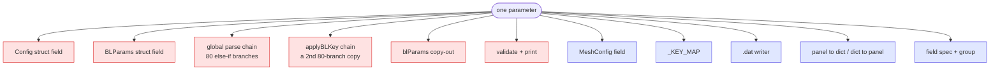
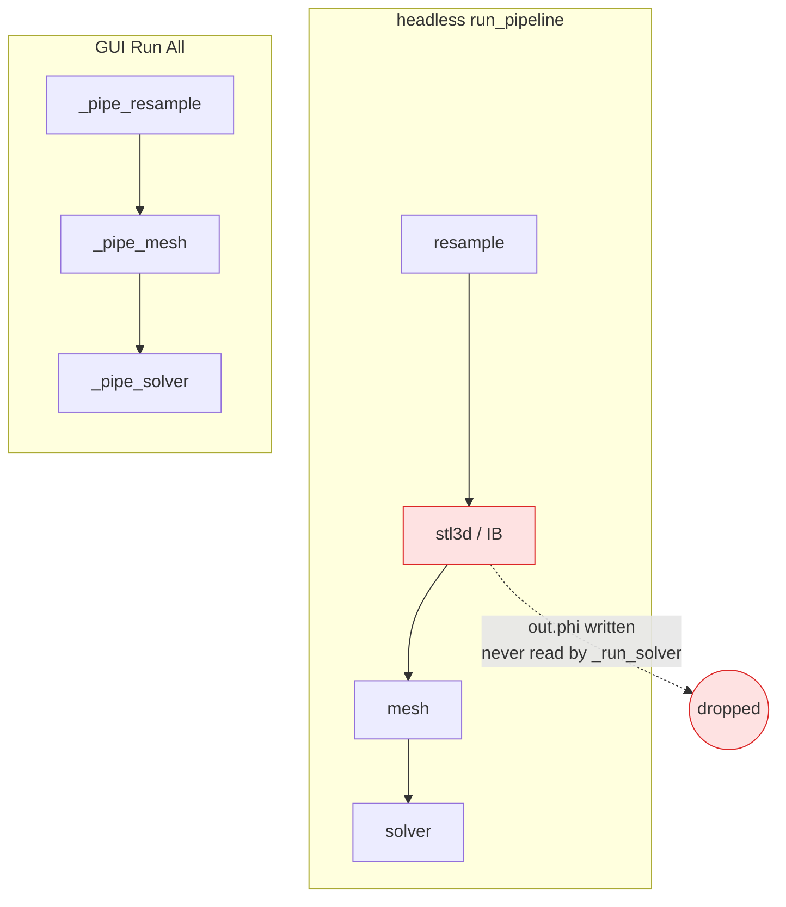
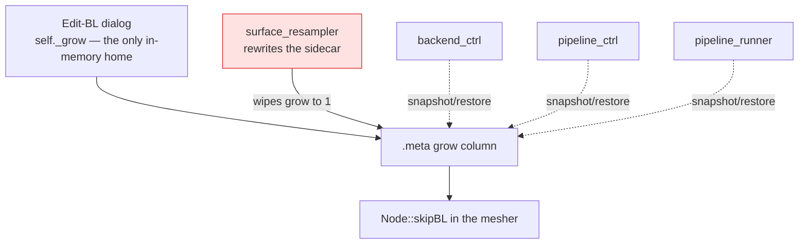

# Architecture review — HybMesh2D

**Snapshot of 2026-08-14, branch `feat/gui-interactive-cad-editing`, commit `854f53e`.**

> **This document is FROZEN. It is rationale, not status.**
>
> Read it for the `file:line` evidence, the deletion tests and the reasoning behind
> each candidate. Do **not** read it to find out what is left to do — it cannot know.
> Run `python3 tools/PreProcessor/tests/arch_probes.py` for that; it re-derives every
> candidate's state from the tree in about a second.
>
> The document is never updated, and that is deliberate: a snapshot that admits its
> date stays honest, while a status list edited by hand decays in silence. It had
> already gone stale three days after it was written — see "What this document could
> not know" at the end.
>
> Every line number below is relative to `854f53e`. Re-measure before quoting one.

Measured at the time of the review:

| | |
|---:|---|
| 1120 | lines in `generate()` |
| 0 | C++ test targets |
| 394 | `self.` names the 41 mixins assume |
| 40 | attributes declared in `AppController.__init__` |

No `CONTEXT.md` and no `docs/adr/` existed, so no candidate below contradicts a
recorded decision. Domain terms are taken from `docs/architecture_overview.md`.

---

## 1 · Close the sidebar seam the way the log seam was closed

**Strong · in-process**

`controllers/signal_wiring_ctrl.py` · `transform_ctrl.py` · `segment_distribution_ctrl.py` · `segment_ctrl.py` · `transform_apply_ctrl.py` · `views/sidebar.py` · `views/panels/edge_props_shape_build_mixin.py`

**Problem.** Controllers name 136 distinct sidebar widgets, 389 times, through the
`sb = self.main_window.sidebar_view` alias — which is also what hides the coupling
from a grep. Reach-throughs by file: `signal_wiring` 116, `transform_ctrl` 71,
`segment_distrib` 56, `segment_ctrl` 56, `transform_apply` 26, `curve_ctrl` …,
plus 5 more.

**Solution.** The sidebar exposes intent verbs, not widgets — `edge_params()`,
`show_params()`, `set_enabled()` — with the 136 widgets inside. Population stays
`_loading`-guarded, exactly as `set_config` already does for the three stage panels.

**Deletion test.** Complexity reappears across ~10 callers — the reads are real work.
A seam pays here; a merge would not.

**Wins.** One interface, 10 callers · widget renames stop rippling · 244 three-level
chains collapse · controllers testable against a stub sidebar · gate it like
`test_user_log_seam.py`.

**Precedent in-repo.** 255 `main_window.log_panel.log(...)` reach-throughs became
`AppController.log()` with a static test failing the build on a new one. The
widget-level leak is larger and has no equivalent seam.

---

## 2 · Give the mesher a seam that is not the process

**Strong · in-process**

`src/BoundaryLayer.cpp:292-1412` · `src/Mesh.cpp:699-1382` · `src/main.cpp:426-1008` · `CMakeLists.txt:117-125`

**Problem.** `CMakeLists.txt` has no `enable_testing`, no `add_test`, and no library
target — the three `.cpp` files compile only into `add_executable(HybMesh2D …)`.
Nothing can link them, so every claim about the boundary-layer scheme is verified by
running the whole binary and diffing files — and the repo already records that the
mesher's output is nondeterministic across identical runs.

The only seam is argv plus the filesystem, with nothing between the process and 2385
lines of implementation:

- `main()` — 582 lines: argv (two passes) · domain · roles · collision · nodes ·
  growth modes · per-segment BL · BC recording
- `generate()` — 1120 lines: normals · fans · concave · junctions · transition · smoothing
- `generateFarFieldGmsh()` — 683 lines: size field · gmsh call · ceiling report

**Solution.** Compile the implementation into a library the executable links, then
move the phases of `generate()` behind named interfaces the way `classifyJunctions`
already was — its own header comment says being inline in 1300 lines is what made it
untestable. Two adapters justify the seam: the CLI, and the tests.

**Deletion test.** Complexity reappears — this is the product. The interface is
missing, not the work.

**Wins.** A junction case testable without a mesh run · BL bugs stop needing an E2E
repro · nondeterminism stops blocking verification · CI gains a third gate it can
afford · `FrontState`'s 22 fields shrink to phase inputs.

---

## 3 · Declare a mesh parameter once, not ten times in two languages

**Strong · ports & adapters**

`include/Config.hpp:17,126,317,424,477,503,599` · `models/mesh_config.py:69-72` · `models/mesh_config_keys.py:38` · `models/mesh_config_io.py:241` · `views/panels/mesh_bl_mixin.py:62,94` · `views/panels/mesh_bl_field_specs.py:31,73,118`

**Problem.** One parameter is declared at 10 sites across C++ and Python.
`Config.hpp` alone lists the BL parameters four times — struct fields, the global
`key == "…"` chain, the `blParams()` copy-out, and a second full chain in
`applyBLKey`. Consistency is checked by a test that greps the C++ source text for
`key == "…"` strings.

Tracing `BL_JUNCTION_ANGLE_C2`:



**Solution.** One declaration of the parameter set — name · type · default · range ·
group · unit — from which the C++ parse/validate/print, the Python model and `.dat`
writer, and the dialog field spec are generated or driven. The `.dat` file stays the
seam between the languages; both sides read their side of it from the schema instead
of from a hand-kept list. `mesh_bl_field_specs.py` already **is** this table for the
21 BL parameters — for the dialog only. Widening it is the change.

**Deletion test.** Complexity reappears in ten places — which is the situation today.

**Wins.** A new parameter is one edit · parity becomes structural, not grepped ·
"GUI writes it, C++ ignores it" cannot occur · units and ranges live with the name ·
two source-text tests retire.

---

## 4 · Retire the signal-wiring table — 113 assumed names, 0 public methods

**Strong · in-process**

`controllers/signal_wiring_ctrl.py:1-350` (`_wire_*` at :10 :148 :157 :214 :249 :290) · sole caller `controller.py:192-197` · precedent `controllers/undo_ctrl.py:154-181`

**Problem.** The module has one caller and duplicates nothing — it is `__init__`'s
body relocated to satisfy a line count. Interface ≈ implementation: 113 names assumed
on `self`, 350 lines of `connect()`. Line 67-77 wires 35 spin boxes to one handler by
hand-listing every widget name, so adding a shape field means editing three files.

**Solution.** Wiring is a property of the widget-owning panel: one `bind(panel)` verb
that introspects widgets and wires declared verbs. `undo_ctrl.py:154-181` already
wires every editable widget on three panels by `findChildren` introspection with no
name list at all — the pattern is proven in-repo.

**Deletion test.** Complexity vanishes. Textbook pass-through.

**Wins.** Widest implicit interface in the repo, gone · a new field is one file, not
three · wiring lives with the widget · removes 116 of the 389 sidebar reach-throughs.

---

## 5 · One field-spec table per config panel, not a build half and a sync half

**Strong · in-process**

`views/panels/solver_config_build_mixin.py` · `solver_config_build_mixin_b.py` · `solver_config_sync_mixin.py` · `mesh_config_build_mixin.py` · `mesh_config_config_mixin.py` · `mesh_sizing_mixin.py` · `mesh_bl_mixin.py` · model: `mesh_bl_field_specs.py`

**Problem.** Panels were split into "build the widgets" and "read/write the widgets".
The interface between the halves is the entire widget set, passed implicitly through
`self`:

- `solver_config_build_mixin` assigns 51 widget attributes
- `solver_config_build_mixin_b` assigns 37 more — "split to keep each file small"
- → 77 names, implicit via `self`
- `solver_config_sync_mixin` reads 77 of them in `get_config` / `_set_config_body`
- mesh panel: 56 assigned → three readers (36 / 24 / 21), no owner
- `test_panel_model_sync.py` — 405 lines of AST — exists to prove the three lists agree

`mesh_sizing_mixin` and `mesh_bl_mixin` define 0 public methods each while assuming
40 and 31 names.

**Solution.** Generalise the pattern already used for the 21 BL parameters: a
per-panel spec table — name, model attribute, widget kind, range, unit — walked once
to build, once to read, once to write. One mention per field; the AST test has
nothing left to prove.

```
FIELD_SPECS
  ("BL_GROWTH_RATE", "bl_growth_rate", "float", lo=1.0, hi=3.0, unit=None)
         ↓ build        ↓ read        ↓ write
```

**Deletion test.** Complexity vanishes on merge — there is only ever one caller.

**Wins.** Units, ranges, defaults in one row · `PRESERVED_FIELDS` becomes derivable ·
a field cannot go stale silently · composes with candidate 3's schema.

---

## 6 · Give the pipeline a stage seam — it has two orchestrations and they have diverged

**Strong · local-substitutable**

`services/pipeline_runner.py:121,190,233,296,364-430` · `controllers/pipeline_ctrl.py:82-225`

**Problem.** The stage sequence and the artifact hand-off are written twice — once as
a blocking function chain, once as `finished_signal` callbacks — and have already
drifted apart: the GUI runs no immersed-boundary stage at all, while headless
produces `out["phi"]` that `_run_solver` never reads, so that stage's result silently
does not reach the solve.



**Solution.** Declare the stages and what each consumes and produces once. The two
runners become adapters differing only in how they wait — blocking subprocess, or
QThread signal-chained — both producing the same artifacts: cad · phi · vtk · result.
Two adapters justify the seam. The stage set stops being a property of the host.

**Deletion test.** Complexity reappears in both hosts — and the divergence is the
evidence it already has.

**Wins.** A stage cannot exist in one host only · an unconsumed artifact becomes
visible · stage order in one place · batch queue and Run All share it.

---

## 7 · Give "the edge being edited" an owner

**Strong · in-process**

`controller.py:161-177` · `controllers/pending_edit_ctrl.py` · `curve_edit_ctrl.py` · `curve_draw_ctrl.py` · `file_edit_ctrl.py`

**Problem.** The modal state of an in-progress edge edit — which segment, which
dialog, new-vs-edit, revert snapshots, the corner map — is 12 attributes declared on
the god object (`_pending_seg`, `_pending_file`, `_edit_in_progress`, `_pending_new`,
`_revert_snap`, `_corner_map`, `_pending_dlg`, `_pending_idx`, + 4 more) and mutated
from four mixins. "Live or absent" is enforced only by convention.
`pending_edit_ctrl` and `file_edit_ctrl` define 0 public methods each; neither is
callable except as part of the whole.

**Solution.** One module owning the 12 fields behind `begin` / `update` / `commit` /
`cancel` / `is_active`, holding its own revert snapshots. Callers ask questions
instead of sharing variables.

**Deletion test.** Complexity reappears — genuine modal state with real transitions.
It deserves a module; it does not have one.

**Wins.** The half-open-edit invariant becomes enforceable · `_edit_in_progress`
stops being a convention · testable without booting Qt · 68 cross-module calls shrink.

---

## 8 · Give the per-segment No-BL flag a model

**Worth exploring · in-process**

`views/panels/mesh_dialogs_bl.py:42-45,137,141` · `services/meta_io.py` (sole holder of `grow_bl`) · `controllers/pipeline_ctrl.py:136,157` · `controllers/backend_ctrl.py:295,459` · `services/pipeline_runner.py:137,157`

**Problem.** `grow_bl` appears in exactly one GUI file — `services/meta_io.py`. Its
only in-memory home is a private dict inside a dialog. The resampler resets the column
on every save, so three call sites independently wrap the subprocess to snapshot and
restore it, and the restore is refused whenever the segment id set changed.



**Solution.** Both halves of the per-segment fact — the No-BL flag and the BC label —
become model fields, and exactly one module writes the sidecar from the model. Three
snapshot/restore call sites disappear with the wipe they compensate for.

**Deletion test.** Complexity reappears at three call sites today — which is why the
snapshot/restore pair exists.

**Wins.** The fact survives a re-save by construction · undo reaches it like every
other edit · it reaches the workspace and pipeline script · one writer of the sidecar.

**Weigh the reverted attempt.** Making the resampler preserve the prior sidecar was
tried and reverted — a new geometry written over an existing output name inherited the
old geometry's flags. This candidate moves the fact **up** into the model rather than
back down into the resampler, so that failure mode does not return; confirm that
reading before committing.

---

## 9 · Split `app/utils.py` at the Qt line

**Worth exploring · ports & adapters**

`app/utils.py:1-14` · `services/pipeline_runner.py:23-27` · `services/solver_case.py:17` · `services/stl3d_case.py:22` · `models/shape_spec.py:26`

**Problem.** `utils.py` is a namespace, not a module — it has no interface. 476 lines
holding both Qt helpers (`report_error` · `confirm` · `block_signals` · `keep_on_top`
· form builders) and pure path resolution (`repo_root` · `find_binary_executable` ·
`find_solver_executables`). Because it is one file, the three services that exist to
be Qt-free drag PyQt6 into the headless runner to get three pure path functions —
`services/pipeline_runner.py` imports `repo_root` three lines above a comment that
reads "Qt-free … so this module stays headless-safe".

Measured: importing it loads `PyQt6.QtCore` · `QtGui` · `QtWidgets` · `sip`.

**Solution.** Put the seam where the dependency actually falls: pure path resolution
in its own Qt-free module (`services/paths.py`), Qt helpers keeping the `utils` name.
`run_pipeline.sh` and `run_batch.sh` stop needing PyQt6 installed.

**Deletion test.** Complexity reappears — the behaviour is real. It is several modules
wearing one name, and the name is placed on the wrong side of the seam.

**Wins.** Headless runs on a machine without Qt · the Qt-free claim becomes checkable
· cheapest candidate on the list · CI can gate it with one import test.

---

## 10 · Name the refresh contract — 35 verbs, 124 call sites, no owner

**Worth exploring · in-process**

`controller.py:371-453` (`_apply_geometry_update`, `_sync_file_segments`) · 35 refresh/sync/update/redraw methods across `controllers/`

**Problem.** After changing geometry a caller must know which of 35 refresh verbs to
invoke and in what order. The de-facto orchestrator, `_apply_geometry_update`, calls
nine of them across six files — `_clear_geometry_canvas`, `_geometry_connect`,
`refresh_status_selection`, `_refresh_closing_edge`, `_sync_closed_mode_ui`,
`_sync_file_segments`, `_update_undo_redo_buttons`, `detect_open_endpoints` — guarded
by three separate active-session checks. The ordering was arrived at empirically, and
load paths re-derive it independently.

**Solution.** One `geometry_changed(points? splits? selection? closure?)` verb taking
what changed, with the fan-out order, the active-session checks and the 35 refresh
verbs inside it. 124 call sites learn one verb instead of a sequence.

**Deletion test.** Complexity reappears, badly — every caller re-derives the order.
The work is real; the interface is missing.

**Wins.** Repaint ordering has one owner · load paths stop re-deriving it · a missed
refresh is one bug, one fix.

---

## Genuinely deep — leave these alone

Read this list before "improving" anything in it.

- **`commands/*.py`** — three verbs hiding undo/redo for 26 CAD operations, with 2
  controller reach-throughs total. Real depth, real seam.
- **`panel_sync_ctrl.py`** — 5 public methods, 4 assumed names, three adapters behind
  a table. The deepest controller in the repo; use it as the model for the others.
- **`get_config` / `set_config` / `_set_config_body`** — three independent adapters,
  so a real seam. The `_loading` flag living on the panel is correct and load-bearing.
- **The canvas mixins** — real verbs, and `CanvasView` talks back by signal rather
  than reaching into the controller. These splits earned their keep.
- **`Mesh::recordBoundaryEdge` / `boundaryEdgeInfo`** — two parallel maps made one
  private fact. Already the shape the rest of `Mesh` should take.
- **`services/user_log.py`** — already the seam candidate 1 wants for the sidebar.
  Copy it, don't touch it.

---

## Top recommendation (as of 2026-08-14)

**1 · Close the sidebar seam the way the log seam was closed.**

It is the largest single source of coupling — 136 widget names, 389 uses, 10 callers —
and it is the one deepening whose shape this project has already proven, gated and
lived with. The log seam retired 255 reach-throughs and left behind a static test that
fails the build on a new one; the same move applies here at greater scale. It also
unblocks the rest: shrinking each mixin's assumed-name count is what makes candidates
4, 5 and 7 constructible against stubs, and what makes a controller testable without
booting Qt.

If you would rather start where verification is weakest than where coupling is worst,
take **2 · Give the mesher a seam that is not the process** instead — 2385 lines of the
product's core have no test surface below the process, and the repo already records
that its output is not byte-reproducible. The cheapest is **9 · Split `app/utils.py` at
the Qt line**.

---

## What this document could not know

Added when the document was checked in on 2026-08-17, as a label on the artefact —
the candidates above are left exactly as written.

By 2026-08-17 the review was three days old and **both of its recommendations were
already done**: candidate 1 in six commits (`68d3945`..`23bbe34`, gated by
`tests/test_sidebar_seam.py`), candidate 2 in five (`ea80355`..`d11dcc3`, gated by
`test_cpp_linkable_seam.py` and `test_cpp_pure_layer.py`). Candidate 4's premise had
gone with them — the hand-listed 35 spin boxes at `signal_wiring_ctrl.py:67-77` no
longer exist.

None of that is visible from this file, and re-deriving it by hand took six rounds of
measurement and still produced one wrong answer on the first pass. That is the whole
argument for `tools/PreProcessor/tests/arch_probes.py`: **run the probes, do not read
this document for status.**
