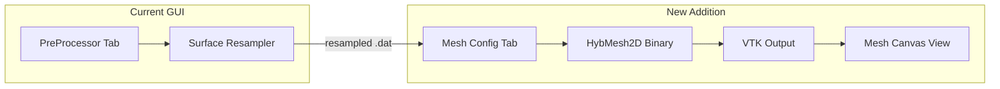

# PreProcessor GUI 改善與 HybMesh2D 整合計劃

本計劃分為兩大部分，共 **9 個階段**，設計為可由不同 model 分次獨立執行。

---

# Plan A：PreProcessor GUI Bug Fixes & Refactoring

## Phase 1：Critical Bugs（關鍵缺陷修復）

> [!CAUTION]
> 這些問題會導致資料損壞、崩潰或不正確的行為。每個修復獨立可執行。

### 1.1 `CreateSegmentsFromIndicesCmd._execute_curve_segment` 覆蓋 split indices

**檔案**: [segment_cmds.py](file:///Users/hjlu_nchc/home/NCHC/CESE/HybMesh/tools/PreProcessor/gui/app/commands/segment_cmds.py#L397-L400)

**問題**: L398-399 用 `=` 完全覆寫 `split_indices`，丟棄所有現有 file segment 的 split。

```diff
-        new_split_indices = [start_idx + i for i in self.split_indices]
-        self.session.split_indices = new_split_indices
-        self.session.split_indices.sort()
+        new_split_indices = [start_idx + i for i in self.split_indices]
+        self.session.split_indices.extend(new_split_indices)
+        self.session.split_indices = sorted(list(set(self.session.split_indices)))
```

---

### 1.2 `RemoveSegmentCmd` 索引調整使用 `>= del_start`（不正確）

**檔案**: [segment_cmds.py](file:///Users/hjlu_nchc/home/NCHC/CESE/HybMesh/tools/PreProcessor/gui/app/commands/segment_cmds.py#L124-L130)

**問題**: `>= del_start` 會將落在刪除範圍內的索引也做位移，應改為 `> del_end`（與 `DuplicateTransformCmd` 一致）。

```diff
         for other in self.session.project_model.segments:
             if other is not seg and other.type == "file":
-                if other.start_index >= del_start:
+                if other.start_index > del_end:
                     other.start_index -= num_deleted
-                if other.end_index >= del_start:
+                if other.end_index > del_end:
                     other.end_index -= num_deleted
```

---

### 1.3 Controller 曲線段列表索引錯誤

**檔案**: [controller.py](file:///Users/hjlu_nchc/home/NCHC/CESE/HybMesh/tools/PreProcessor/gui/app/controller.py#L1460-L1463)

**問題**: `session.current_segment_idx`（全域段索引）被用作 `curve_segment_list` 的列表行號，但 curve list 只包含 curve items。

```diff
-        idx = session.current_segment_idx
-        if 0 <= idx < sb.curve_segment_list.count():
-            item = sb.curve_segment_list.item(idx)
+        seg_idx = session.current_segment_idx
+        for row in range(sb.curve_segment_list.count()):
+            item = sb.curve_segment_list.item(row)
+            if item.data(Qt.ItemDataRole.UserRole) == seg_idx:
+                break
+        else:
+            return
```

此修正與 [_select_segment_by_index](file:///Users/hjlu_nchc/home/NCHC/CESE/HybMesh/tools/PreProcessor/gui/app/controller.py#L1082-L1087) 的正確方式一致。

---

### 1.4 `_record_segment_state_change` 繞過 CommandHistory API

**檔案**: [controller.py](file:///Users/hjlu_nchc/home/NCHC/CESE/HybMesh/tools/PreProcessor/gui/app/controller.py#L1273-L1275)

**問題**: 直接 append 到 `_undo_stack`，跳過 `execute()`。

**方案**: 在 `CommandHistory` 新增 `record()` 方法：

```python
# base.py — 新增方法
def record(self, cmd: BaseCommand):
    """Record a command without executing it (already applied)."""
    self._undo_stack.append(cmd)
    self._redo_stack.clear()
```

然後修改 controller.py：
```diff
-        session.command_history._undo_stack.append(cmd)
-        session.command_history._redo_stack.clear()
+        session.command_history.record(cmd)
```

---

### 1.5 `BakeCurveToGeometryCmd` 中間範圍索引映射錯誤

**檔案**: [segment_cmds.py](file:///Users/hjlu_nchc/home/NCHC/CESE/HybMesh/tools/PreProcessor/gui/app/commands/segment_cmds.py#L491-L498)

**問題**: `(s, e)` 範圍內非邊界的索引全部被映射到 `s + num_new_pts - 1`。

```diff
             # Adjust start_index
             if other_seg.start_index > e:
                 other_seg.start_index += diff
-            elif s <= other_seg.start_index <= e:
-                other_seg.start_index = s if other_seg.start_index == s else (s + num_new_pts - 1)
+            elif other_seg.start_index == s:
+                pass  # 不動
+            elif s < other_seg.start_index <= e:
+                other_seg.start_index = s + num_new_pts - 1
             
             # Adjust end_index  
             if other_seg.end_index > e:
                 other_seg.end_index += diff
-            elif s <= other_seg.end_index <= e:
-                other_seg.end_index = s if other_seg.end_index == s else (s + num_new_pts - 1)
+            elif other_seg.end_index == s:
+                pass  # 不動
+            elif s < other_seg.end_index <= e:
+                other_seg.end_index = s + num_new_pts - 1
```

---

### 1.6 `_active_session_id` 未在 `CanvasView.__init__` 中初始化

**檔案**: [canvas.py](file:///Users/hjlu_nchc/home/NCHC/CESE/HybMesh/tools/PreProcessor/gui/app/views/canvas.py#L29-L49)

```diff
         self._show_symbols = True
         self._show_nodes = True
+        self._active_session_id: int | None = None
```

同時移除所有 `hasattr(self, "_active_session_id")` 和 `getattr(self, "_active_session_id", None)` guard，改為直接用 `self._active_session_id`。

---

### 1.7 Per-session state 存在 controller 層級

**檔案**: [controller.py](file:///Users/hjlu_nchc/home/NCHC/CESE/HybMesh/tools/PreProcessor/gui/app/controller.py#L155-L159)

**問題**: `_param_snapshot` 和 `_segment_state_snapshot` 在切換 tab 後仍保留上一個 tab 的值。

**方案**: 將這些欄位移入 `GeometrySession`：

```python
# session.py — 新增欄位
self.param_snapshot: dict = {}
self.segment_state_snapshot: dict = {}
```

Controller 中改為 `session.param_snapshot` / `session.segment_state_snapshot`。

---

### 1.8 Closed geometry 端點檢查未考慮閉合點

**檔案**: [controller.py](file:///Users/hjlu_nchc/home/NCHC/CESE/HybMesh/tools/PreProcessor/gui/app/controller.py#L927-L929)

```diff
         n_pts = (len(session.original_points)
                  if session.original_points is not None else 0)
-        is_endpoint = (idx == 0 or idx == n_pts - 1)
+        is_closed = session.project_model.is_closed
+        is_endpoint = (idx == 0 or idx == n_pts - 1) if not is_closed else False
```

封閉幾何中無「端點」概念，所有點均可作為 split point。

---

## Phase 2：Major Bugs & Thread Safety

### 2.1 多個 Command 缺少 `is_geometry_modified` 標記

**受影響 Commands**:
- [AddSplitCmd](file:///Users/hjlu_nchc/home/NCHC/CESE/HybMesh/tools/PreProcessor/gui/app/commands/split_cmds.py#L5-L26) — 無 modified flag
- `UpdateStrategyCmd`, `UpdateParamsCmd` — 在 segment_cmds.py 中
- `ToggleIsClosedCmd`, `ToggleGlobalSplineCmd`, `ToggleMatchPreviousCmd`, `UpdateSegmentStateCmd`

**修正模式**（以 AddSplitCmd 為例）：
```diff
     def __init__(self, session, idx: int, sync_cb, refresh_cb):
         ...
+        self._old_modified = session.is_geometry_modified
 
     def execute(self):
         if self.idx not in self.session.split_indices:
             self.session.split_indices.append(self.idx)
             self.session.split_indices.sort()
+        self.session.is_geometry_modified = True
         self.sync_cb()
 
     def undo(self):
         if self.idx in self.session.split_indices:
             self.session.split_indices.remove(self.idx)
+        self.session.is_geometry_modified = self._old_modified
         self.sync_cb()
```

---

### 2.2 `RemoveSplitCmd.undo()` 不更新 file segments

**檔案**: [split_cmds.py](file:///Users/hjlu_nchc/home/NCHC/CESE/HybMesh/tools/PreProcessor/gui/app/commands/split_cmds.py#L66-L71)

```diff
     def undo(self):
         self.session.split_indices = list(self._old_split)
         if not self.keep_vertex and self._old_pts is not None:
             self.session.original_points = self._old_pts.copy()
         self.session.is_geometry_modified = self._old_modified
+        self.session.project_model.update_file_segments_from_indices(
+            self.session.split_indices)
         self.refresh_cb()
```

---

### 2.3 Worker 覆寫防護

**檔案**: [controller.py](file:///Users/hjlu_nchc/home/NCHC/CESE/HybMesh/tools/PreProcessor/gui/app/controller.py#L2173-L2185)

```diff
     def _run_backend(self, exe: str, cfg_path: str,
                      session: GeometrySession, on_finish):
+        if hasattr(self, '_worker') and self._worker is not None and self._worker.isRunning():
+            self.main_window.log_panel.log("Backend is already running. Please wait.")
+            return
         self._worker = BackendWorker(exe, cfg_path)
```

---

### 2.4 BackendWorker 超時/取消機制

**檔案**: [backend_run.py](file:///Users/hjlu_nchc/home/NCHC/CESE/HybMesh/tools/PreProcessor/gui/app/workers/backend_run.py)

```diff
 class BackendWorker(QThread):
     log_signal = pyqtSignal(str)
     finished_signal = pyqtSignal(int)
 
     def __init__(self, executable_path: str, config_path: str):
         super().__init__()
         self.executable_path = executable_path
         self.config_path = config_path
+        self._process: subprocess.Popen | None = None
+        self._cancelled = False
+
+    def cancel(self):
+        self._cancelled = True
+        if self._process and self._process.poll() is None:
+            self._process.terminate()
 
     def run(self):
         try:
             ...
-            process = subprocess.Popen(...)
-            for line in process.stdout:
+            self._process = subprocess.Popen(...)
+            for line in self._process.stdout:
+                if self._cancelled:
+                    self._process.terminate()
+                    self.log_signal.emit("Backend cancelled by user.")
+                    self.finished_signal.emit(-2)
+                    return
                 ...
-            process.wait()
-            self.finished_signal.emit(process.returncode)
+            self._process.wait(timeout=600)  # 10 min timeout
+            self.finished_signal.emit(self._process.returncode)
+        except subprocess.TimeoutExpired:
+            self._process.kill()
+            self.log_signal.emit("Backend timed out (10 min).")
+            self.finished_signal.emit(-3)
         except Exception as e:
             ...
```

---

### 2.5 序列化遺失：非 custom 曲線 formula

**檔案**: [segment.py](file:///Users/hjlu_nchc/home/NCHC/CESE/HybMesh/tools/PreProcessor/gui/app/models/segment.py#L94-L100)

```diff
-            if self.curve_type == "custom":
-                d["curve_mode"] = self.curve_mode
-                if self.curve_mode == "parametric":
-                    d["x_formula"] = self.x_formula
-                    d["y_formula"] = self.y_formula
-                else:
-                    d["formula"] = self.formula
+            d["curve_mode"] = self.curve_mode
+            if self.curve_mode == "parametric":
+                d["x_formula"] = self.x_formula
+                d["y_formula"] = self.y_formula
+            else:
+                d["formula"] = self.formula
```

> [!NOTE]
> 保持向後相容：`from_dict()` 已經能正確處理有無 formula 欄位的情況。

---

### 2.6 `update_file_segments_from_indices()` 保留 segment 設定

**檔案**: [project.py](file:///Users/hjlu_nchc/home/NCHC/CESE/HybMesh/tools/PreProcessor/gui/app/models/project.py#L23-L44)

**方案**: 當精確 key 不匹配時，嘗試找到重疊最大的舊 segment 繼承設定：

```diff
         for i in range(len(split_indices) - 1):
             start, end = split_indices[i], split_indices[i + 1]
             key = (start, end)
             if key in existing_map:
                 seg = existing_map[key]
                 seg.id = i + 1
             else:
-                seg = SegmentModel(i + 1, start, end)
+                # Try to inherit settings from most-overlapping old segment
+                seg = SegmentModel(i + 1, start, end)
+                best_overlap = 0
+                for (old_s, old_e), old_seg in existing_map.items():
+                    overlap = max(0, min(end, old_e) - max(start, old_s))
+                    if overlap > best_overlap:
+                        best_overlap = overlap
+                        seg.strategy = old_seg.strategy
+                        seg.parameters = copy.deepcopy(old_seg.parameters)
+                        seg.match_previous = old_seg.match_previous
             new_file_segs.append(seg)
```

---

### 2.7 Canvas 點擊距離閾值

**檔案**: [canvas.py](file:///Users/hjlu_nchc/home/NCHC/CESE/HybMesh/tools/PreProcessor/gui/app/views/canvas.py#L468-L478)

```diff
     def _on_mouse_clicked(self, event):
         ...
         dists = np.sqrt((self._active_points[:, 0] - x) ** 2
                         + (self._active_points[:, 1] - y) ** 2)
-        self.point_clicked.emit(int(np.argmin(dists)))
+        nearest_idx = int(np.argmin(dists))
+        # Convert data-space distance to pixel distance for threshold
+        vb = self.plot_widget.plotItem.vb
+        nearest_pt = self._active_points[nearest_idx]
+        p1 = vb.mapViewToScene(pg.Point(x, y))
+        p2 = vb.mapViewToScene(pg.Point(nearest_pt[0], nearest_pt[1]))
+        pixel_dist = ((p1.x() - p2.x())**2 + (p1.y() - p2.y())**2)**0.5
+        if pixel_dist < 30:  # 30 pixel threshold
+            self.point_clicked.emit(nearest_idx)
```

---

## Phase 3：Architecture 重構

### 3.1 Controller God Class 拆分

**目標**: 將 [controller.py](file:///Users/hjlu_nchc/home/NCHC/CESE/HybMesh/tools/PreProcessor/gui/app/controller.py)（2236 行）拆為：

| 新檔案 | 職責 | 從 controller.py 抽取的方法 |
|--------|------|---------------------------|
| `controllers/session_ctrl.py` | Tab/Session 管理、檔案載入 | `_new_session`, `close_tab`, `switch_tab`, `load_geometry*`, `load_json_config`, `_apply_json_config`, `_sync_geometry_list`, `new_blank_tab` |
| `controllers/segment_ctrl.py` | Segment CRUD、策略/參數管理 | `_refresh_segment_list`, `handle_file_seg_*`, `handle_curve_seg_*`, `_select_segment_by_index`, `handle_strategy_changed`, `_repopulate_strategy`, `_read_params_*`, `_record_segment_state_change` |
| `controllers/transform_ctrl.py` | Duplicate/Mirror/Rotate/Scale | `duplicate_with_transform`, `update_duplicate_preview`, `update_duplicate_base_point`, `handle_dup_*`, `on_duplicate_param_changed` |
| `controllers/curve_ctrl.py` | 曲線公式、preview、bake | `preview_curve_formula`, `add_curve_segment`, `handle_curve_type_changed`, `_sync_active_curve_segment_from_ui`, `bake_curve_to_geometry`, `_compute_curve_preview_pts` |
| `controllers/backend_ctrl.py` | Backend 執行、temp 檔案 | `_find_executable`, `_write_temp_config`, `save_output`, `preview_output`, `_run_backend`, `cleanup_temp_dir`, `export_config_json` |
| `controller.py` | 主協調者 | `__init__`, `active_session`, `show_main_window`, signal wiring, `undo`/`redo`, 各子控制器的建立與協調 |

**實作步驟**:
1. 建立 `app/controllers/` 目錄
2. 建立 `app/controllers/__init__.py`
3. 抽取共用工具到 `app/controllers/helpers.py`（`_eval_formula`, `_eval_formula_array`, `_parse_vertices_str`, `_auto_detect_segments`, `blockSignals` context manager）
4. 逐一建立子控制器（每個子控制器接收 `app_ctrl` 引用）
5. 修改 `controller.py` 的 `AppController` 建立並委派給子控制器

---

### 3.2 消除 Command ↔ Controller 循環依賴

**目前**: Commands 呼叫 `self.session.controller._compute_curve_preview_pts()` 和 `self.session.controller._apply_geometry_update()`。

**方案**: 將核心計算邏輯抽取到 `app/services/geometry_service.py`：

```python
class GeometryService:
    """Pure computation service, no UI dependency."""
    
    @staticmethod
    def compute_curve_preview_pts(seg, n, eval_fn, parse_fn) -> tuple[np.ndarray, np.ndarray]:
        ...
    
    @staticmethod  
    def apply_geometry_update(session, re_detect=False):
        """Update split indices and rebuild file segments."""
        ...
```

Commands 透過 `self.geo_service.method()` 呼叫，不再需要 `session.controller`。

---

### 3.3 Sidebar God Class 拆分

**目標**: 將 [sidebar.py](file:///Users/hjlu_nchc/home/NCHC/CESE/HybMesh/tools/PreProcessor/gui/app/views/sidebar.py)（1088 行）拆為：

| 新檔案 | 職責 | 行數估計 |
|--------|------|----------|
| `views/panels/file_panel.py` | 檔案載入/匯出區 | ~60 |
| `views/panels/geometry_panel.py` | 幾何列表管理 | ~60 |
| `views/panels/vertex_panel.py` | Split/Insert vertex | ~100 |
| `views/panels/segment_props_panel.py` | Segment 策略/參數 | ~300 |
| `views/panels/curve_shape_panel.py` | 曲線形狀參數 (shape_stack) | ~250 |
| `views/panels/transform_panel.py` | 幾何變換 | ~80 |
| `views/panels/duplicate_panel.py` | 複製/鏡射面板 | ~200 |
| `views/sidebar.py` | 主容器，組合上述面板 | ~100 |

---

### 3.4 抽取索引調整邏輯為共用方法

**重複代碼**: `RemoveSegmentCmd.execute()` L91-131 和 `DuplicateTransformCmd.execute()` L586-617。

```python
# project.py 或 helpers.py — 新增
def remove_points_and_adjust_indices(session, seg, del_start, del_end):
    """Remove points from original_points and adjust all related indices."""
    ...
```

---

### 3.5 建立 `blockSignals` context manager

**檔案**: 新增 `app/utils.py`

```python
from contextlib import contextmanager

@contextmanager
def block_signals(*widgets):
    for w in widgets:
        w.blockSignals(True)
    try:
        yield
    finally:
        for w in widgets:
            w.blockSignals(False)
```

---

## Phase 4：Code Quality & DRY

### 4.1 抽取重複的 transform 邏輯

**位置**: [controller.py L1625-1665](file:///Users/hjlu_nchc/home/NCHC/CESE/HybMesh/tools/PreProcessor/gui/app/controller.py#L1625-L1665) vs [L1869-1906](file:///Users/hjlu_nchc/home/NCHC/CESE/HybMesh/tools/PreProcessor/gui/app/controller.py#L1869-L1906)

```python
def _apply_transform(self, xs, ys, sb) -> tuple[np.ndarray, np.ndarray]:
    """Apply the selected transform to xs, ys arrays."""
    t_idx = sb.dup_type_combo.currentIndex()
    # ... unified logic
    return xs, ys
```

### 4.2 抽取 curve type label 映射

```python
CURVE_TYPE_LABELS = {
    "custom": lambda seg: f"Curve ({'Param' if seg.curve_mode == 'parametric' else 'Explicit'})",
    "horizontal_line": "H Line",
    "vertical_line": "V Line",
    "line": "Line",
    "circle": "Circle",
    "triangle": "Triangle",
    "quadrilateral": "Quad",
    "polygon": "Polygon",
}
```

### 4.3 修復 `self.layout` 遮蔽問題

- [log_panel.py L6](file:///Users/hjlu_nchc/home/NCHC/CESE/HybMesh/tools/PreProcessor/gui/app/views/log_panel.py#L6): `self.layout` → `self._layout` 或 `_lo`
- [sidebar.py L79](file:///Users/hjlu_nchc/home/NCHC/CESE/HybMesh/tools/PreProcessor/gui/app/views/sidebar.py#L79): `self.layout` → `self._layout`

### 4.4 清理 stale `__init__.py` exports

更新 [commands/__init__.py](file:///Users/hjlu_nchc/home/NCHC/CESE/HybMesh/tools/PreProcessor/gui/app/commands/__init__.py) 包含所有 command class。

### 4.5 移除死碼

| 檔案 | 行號 | 項目 |
|------|------|------|
| sidebar.py | L794-799 | `quality_check_cb`, `show_vertices_cb`（被 main_window.py 的版本遮蔽）|
| controller.py | L155 | `_connecting_signals`（從未使用）|
| controller.py | L1186 | `old_params_snapshot`（未使用）|
| controller.py | L492, 528, 559 | 冗餘 `from PyQt6.QtCore import Qt` |

### 4.6 修復 PEP 8：分號多行

[sidebar.py L500-527](file:///Users/hjlu_nchc/home/NCHC/CESE/HybMesh/tools/PreProcessor/gui/app/views/sidebar.py#L500-L527)：將 Triangle/Quad spinbox 的分號多行改為獨立行。

### 4.7 `_redo_stack` 加入 maxlen

[base.py L29](file:///Users/hjlu_nchc/home/NCHC/CESE/HybMesh/tools/PreProcessor/gui/app/commands/base.py#L29):
```diff
-self._redo_stack: deque[BaseCommand] = deque()
+self._redo_stack: deque[BaseCommand] = deque(maxlen=self.MAX_DEPTH)
```

### 4.8 滑鼠按鈕 enum 檢查

[canvas.py L472](file:///Users/hjlu_nchc/home/NCHC/CESE/HybMesh/tools/PreProcessor/gui/app/views/canvas.py#L472):
```diff
-if btn != Qt.MouseButton.LeftButton and btn != 1:
+if btn != Qt.MouseButton.LeftButton:
```

---

## Phase 5：Enhancements（僅記錄，暫不執行）

> [!NOTE]
> 以下項目已記錄，未來需要時再執行。

| # | 項目 | 檔案 | 描述 |
|---|------|------|------|
| 5.1 | Formula 向量化 | controller.py L43-45 | 預編譯 expression 並用 numpy 向量操作 |
| 5.2 | closeEvent 處理 | main_window.py | 未儲存變更提示、清理 plot items |
| 5.3 | LogPanel 增強 | log_panel.py | 日誌級別、時間戳、最大行數、清除 |
| 5.4 | requirements.txt 版本固定 | requirements.txt | `PyQt6>=6.5,<7.0` 等 |
| 5.5 | 可執行檔尋找改善 | controller.py L2035-2043 | 環境變數、PATH 搜尋 |
| 5.6 | pyqtgraph config 移至 main | canvas.py L35-36 | 避免 global state race |
| 5.7 | Stylesheet 統一管理 | 新增 styles.py | 50+ setStyleSheet 集中管理 |
| 5.8 | Session color counter 重置 | session.py L27-31 | 根據可見 session 重新分配 |

---

# Plan B：HybMesh2D 網格生成器 GUI 整合

> [!IMPORTANT]
> 此計劃在 Plan A 完成後執行，因為需要基於重構後的架構。

## 概要

將 `src/main.cpp`（HybMesh2D 混合網格生成器）整合到 GUI 中，新增：
1. **Config Editor Tab**：編輯 `Background_para.dat` 的所有參數
2. **Mesh Generation Workflow**：從 GUI 觸發 HybMesh2D 執行
3. **Mesh Visualization**：在 Canvas 上渲染生成的 VTK 網格

### 架構概覽



---

## Phase B1：VTK Parser & Mesh Visualization

### B1.1 VTK Legacy ASCII Parser

**新檔案**: `app/models/vtk_mesh.py`

```python
class VTKMesh:
    """Parse and store a VTK Legacy ASCII unstructured grid."""
    
    def __init__(self):
        self.points: np.ndarray = np.empty((0, 2))  # Nx2
        self.triangles: list[tuple[int,int,int]] = []
        self.quads: list[tuple[int,int,int,int]] = []
    
    @classmethod
    def from_file(cls, path: str) -> "VTKMesh": ...
    
    @property
    def bounds(self) -> tuple[float,float,float,float]: ...
```

根據 [Mesh.cpp exportVTK](file:///Users/hjlu_nchc/home/NCHC/CESE/HybMesh/src/Mesh.cpp) 的輸出格式：
- `POINTS` section → 2D 座標 (z=0)
- `CELLS` section → 三角形(3節點) / 四邊形(4節點) 連接
- `CELL_TYPES` section → type 5=Triangle, 9=Quad

### B1.2 Mesh Canvas Widget

**新檔案**: `app/views/mesh_canvas.py`

繼承或封裝 `pyqtgraph.PlotWidget`，新增網格繪製功能：

```python
class MeshCanvasView(QWidget):
    """Canvas for visualizing 2D unstructured meshes."""
    
    def render_mesh(self, vtk_mesh: VTKMesh): ...
    def clear_mesh(self): ...
    def highlight_element(self, idx: int): ...
    def set_color_mode(self, mode: str): ...  # "element_type", "quality", "uniform"
```

- 三角形用一色、四邊形用另一色
- 邊界線加粗
- 支援縮放/平移
- 顯示網格統計（節點數、元素數、邊數）

---

## Phase B2：Background_para.dat Config Editor

### B2.1 Config Model

**新檔案**: `app/models/mesh_config.py`

基於 [Background_para.dat](file:///Users/hjlu_nchc/home/NCHC/CESE/HybMesh/config/Background_para.dat) 和 [Config.hpp](file:///Users/hjlu_nchc/home/NCHC/CESE/HybMesh/include/Config.hpp) 的參數：

```python
@dataclass
class MeshConfig:
    # Section 1: Domain
    domain_x_min: float = -10.0
    domain_x_max: float = 10.0
    domain_y_min: float = -10.0
    domain_y_max: float = 10.0
    
    # Section 2: Mesh Size
    surface_mesh_size: float = 0.02
    auto_surface_size: bool = True
    farfield_mesh_size: float = 1.0
    farfield_growth_rate: float = 0.1
    
    # Section 3: Boundary Layer
    bl_initial_thickness: float = 0.0002
    bl_growth_rate: float = 1.1
    bl_layers: int = 5
    
    # Section 4-7: ... (all 30+ parameters)
    
    def load_from_file(self, path: str): ...
    def save_to_file(self, path: str): ...
    def to_cli_args(self) -> list[str]: ...
```

### B2.2 Config Editor Panel

**新檔案**: `app/views/panels/mesh_config_panel.py`

分為 7 個 `CollapsibleSection`，對應 Background_para.dat 的 7 個區塊：

| Section | 參數數量 | Widget 類型 |
|---------|----------|------------|
| 1. 計算域設定 | 4 | QDoubleSpinBox |
| 2. 基礎網格尺寸 | 4 | QDoubleSpinBox + QCheckBox |
| 3. 邊界層核心 | 3 | QDoubleSpinBox + QSpinBox |
| 4. 尖角處理 | 6 | QComboBox + QSpinBox + QDoubleSpinBox |
| 5. 凹角處理 | 4 | QComboBox + QDoubleSpinBox + QSpinBox |
| 6. 遠場過渡 | 6 | QSpinBox + QDoubleSpinBox + QCheckBox |
| 7. 輸出設定 | 5 | QCheckBox + QComboBox + QLineEdit |

每個參數配有 tooltip 說明。

### B2.3 幾何檔案選擇器

- 列出目前在 PreProcessor 中已重採樣的 `.dat` 檔案
- 支援手動新增/移除幾何檔案
- 顯示每個幾何的 preview（可連動 canvas）

---

## Phase B3：Mesh Generation Workflow

### B3.1 HybMesh2D Runner

**新檔案**: `app/workers/mesh_gen_run.py`

類似 `BackendWorker`，但執行 HybMesh2D：

```python
class MeshGenWorker(QThread):
    log_signal = pyqtSignal(str)
    finished_signal = pyqtSignal(int, str)  # returncode, vtk_path
    
    def __init__(self, executable: str, config_path: str, geom_files: list[str]):
        ...
```

- 支援取消和超時
- 即時輸出日誌到 LogPanel
- 完成後自動載入 VTK 結果

### B3.2 Integration into MainWindow

- 新增 **Mesh Generation** mode/tab 在主視窗中
- Canvas 切換為 `MeshCanvasView` 顯示網格結果
- Sidebar 切換為 Config Editor Panel
- 新增「Generate Mesh」按鈕和進度指示

### B3.3 PreProcessor → Mesh Generator 工作流

```
PreProcessor Tab → 重採樣完成 → 自動填入幾何檔案路徑到 Mesh Config
                                → 切換到 Mesh Generation Tab
                                → 調整參數 → Run → 顯示結果
```

---

## Phase B4：Results Management

### B4.1 Mesh Statistics Panel

顯示 HybMesh2D 的輸出統計：
- Vertices (VRT) 數量
- Elements (CEL) 數量
- Boundary Edges (BND) 數量
- 三角形/四邊形比例
- 最大/最小元素面積
- 最大 aspect ratio

### B4.2 Export Options

- 重新匯出 VTK（路徑可選）
- 匯出 STAR-CD 格式
- 儲存/載入完整 config

---

## Verification Plan

### Plan A Verification
- 對所有修改的 Command 進行手動測試：execute → verify state → undo → verify restored
- 索引調整邏輯的邊界測試（空 segments、單點 segments、相鄰 segments）
- 序列化 round-trip 測試：`to_dict()` → `from_dict()` → `to_dict()` 應產生相同結果
- 啟動 GUI 載入 `gui_config.json` 測試基本功能

### Plan B Verification
- 解析現有 `Results/` 目錄中的 VTK 檔案，驗證 parser
- 修改 Background_para.dat 參數 → 儲存 → 重新載入，驗證 round-trip
- 執行完整工作流：載入 .dat → 重採樣 → 生成網格 → 視覺化
- 驗證 HybMesh2D 的 CLI 參數正確傳遞
